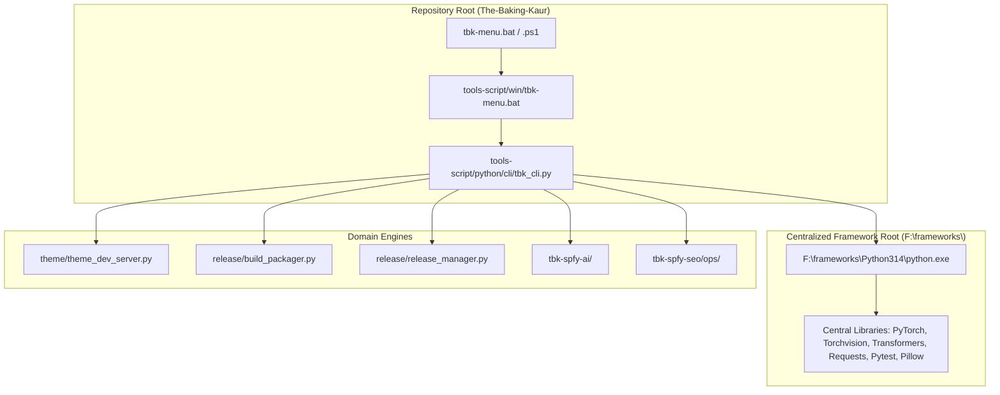
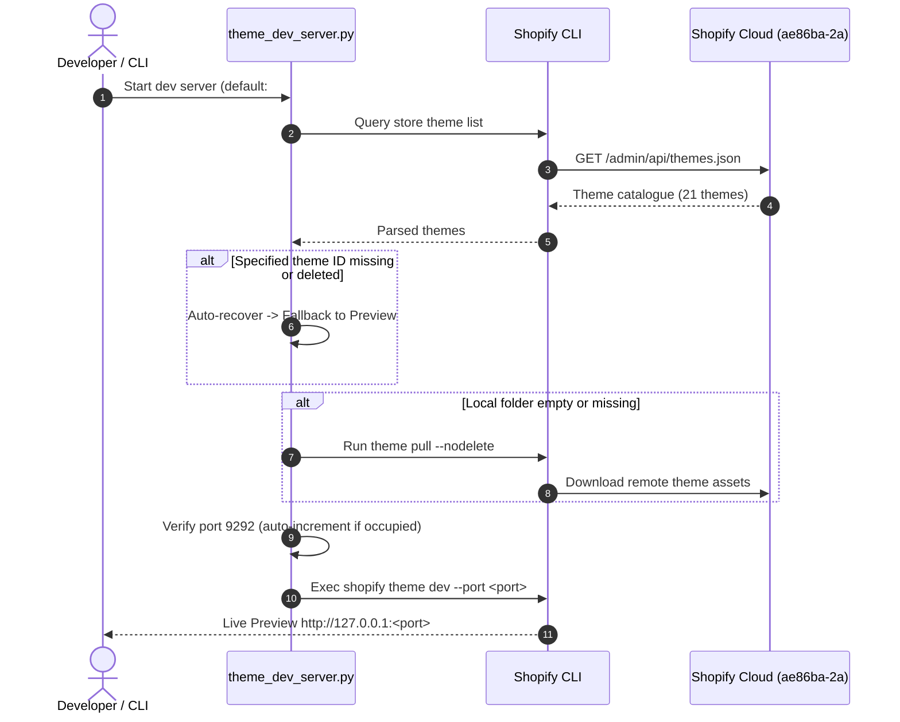

<picture>
  <source media="(prefers-color-scheme: dark)" srcset="../../skills/ThemeStyleOps/assets/banners/lexvora/architecture-dark.svg">
  
</picture>

# ARC_20260906_E — Developer Automation Toolchain, Directory Taxonomy & Master Console Architecture

> **Date:** 2026-09-06 · **Status:** Current Architecture
> **Related Concepts:** [`CON005`](../concept-design/CON005_Unified_Developer_Toolchain_Master_Console_Concept.md)
> **Related Research:** [`RSH_20260906_D`](../research/RSH_20260906_D_developer_toolchain_centralized_runtime_and_console_ux.md)
> **Related Decisions:** [`DEC_20260906_B`](../decisions/DEC_20260906_B_centralized_framework_toolchain_and_script_hierarchy.md)
> **Owning Plans:** [`TOOL`](../plans/02-operations/PLN005-developer-toolchain-and-master-operations-console-plan.md)

---

## 1. Directory Topology (`tools-script/`)

The repository tooling is partitioned across operating systems and functional domains:

```
tools-script/
├── python/                         # Centralized Python automation engines & CLI
│   ├── cli/
│   │   └── tbk_cli.py              # Master interactive console operations CLI
│   ├── release/
│   │   ├── build_packager.py       # Compiles versioned theme packages into build/vX.Y.Z/
│   │   └── release_manager.py      # Publishes structured releases into releases/v<Major>/v<Minor>/
│   └── theme/
│       └── theme_dev_server.py     # Intelligent theme dev server controller & auto-resolver
│
├── win/                            # Windows automation scripts (Batch & PowerShell)
│   ├── tbk-menu.bat                # 1-Click launcher for Windows
│   ├── theme/
│   │   ├── theme_dev.bat / .ps1            # Dev server launcher (preview #152070258857)
│   │   ├── theme_check.bat / .ps1          # Theme Liquid & JSON health check
│   │   ├── theme_deploy_preview.bat / .ps1 # Deploy to Preview theme (#152070258857)
│   │   └── theme_deploy_live.bat / .ps1    # Guarded live deploy with diff protocol (#152071602345)
│   ├── governance/
│   │   ├── pdm_governance.bat / .ps1       # 12-point conformance audit runner
│   │   └── pdm_tasks.bat / .ps1            # ProjectOps v2 task workflow runner
│   ├── seo/
│   │   └── seo_ops.bat / .ps1              # Shopify Admin GraphQL ops (Dry-Run & Apply)
│   ├── ai/
│   │   └── ai_vision.bat / .ps1            # AI Cake Genome & Vision test harness
│   ├── release/
│   │   ├── build_package.bat               # Theme build packager runner
│   │   └── release_publish.bat             # Release publisher runner
│   └── tests/
│       └── run_tests.bat                   # Pytest suite runner (233 tests)
│
└── mac/                            # macOS & Linux automation shell scripts
    ├── tbk-menu.sh                 # Master CLI launcher for macOS / Linux
    ├── theme/
    │   ├── theme_dev.sh            # Dev server launcher
    │   ├── theme_check.sh          # Theme Liquid & JSON health check
    │   ├── theme_deploy_preview.sh # Deploy to Preview theme (#152070258857)
    │   └── theme_deploy_live.sh    # Guarded live deploy with diff protocol
    ├── governance/
    │   ├── pdm_governance.sh       # PDM 12-point conformance audit runner
    │   └── pdm_tasks.sh            # ProjectOps v2 task workflow runner
    ├── seo/
    │   └── seo_ops.sh              # SEO operations runner
    ├── ai/
    │   └── ai_vision.sh            # AI Vision test harness runner
    ├── release/
    │   ├── build_package.sh        # Theme build packager runner
    │   └── release_publish.sh      # Release publisher runner
    └── tests/
        └── run_tests.sh            # Pytest suite runner (233 tests)
```

## 2. Central Framework Runtime Architecture (`ENV_FRM_01`)



## 3. Theme Dev Server Resolution Pipeline



## 4. Master Operations Console State Machine & Logging

- **Session Isolation:** On every launch, `SessionLogger` stamps `logs/sessions/session_<YYYYMMDD_HHMMSS>.log` and links `logs/latest_session.log`.
- **Noise Suppression:** Raw subprocess stdout/stderr streams to the session log file while the console displays crisp step progress cards.
- **Visual Cadence:** ANSI TrueColor palettes matching atelier brand tokens (Rose `#C01457`, Gold `#D4A359`, Platinum, Ivory) with double-line box frames.

## Footer

Parent: [`architecture-master.md`](./architecture-master.md) ·
Decisions: [`../decisions/decisions-master.md`](../decisions/decisions-master.md) ·
Plans: [`../plans/plans-master.md`](../plans/plans-master.md)
