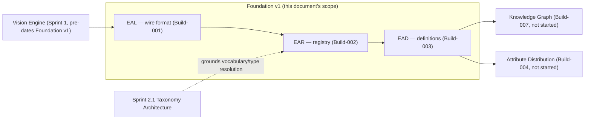
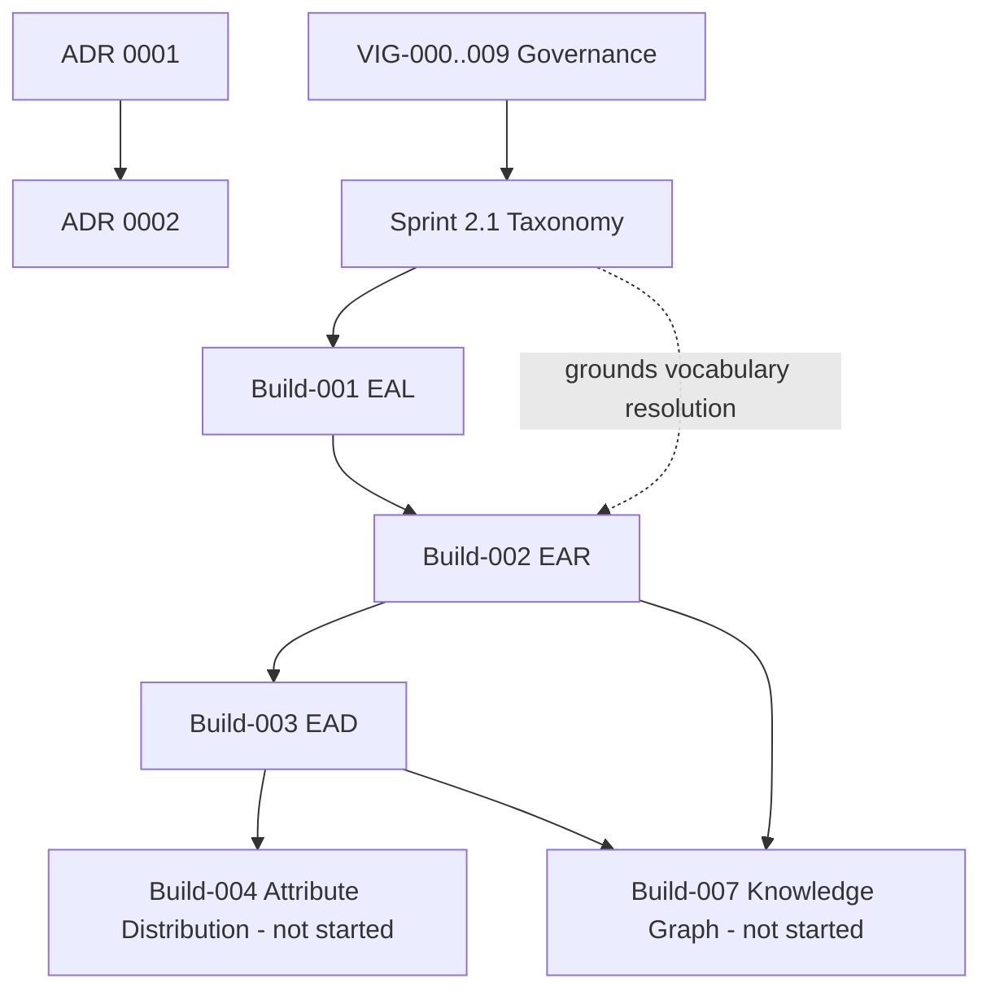

# VISIONARY IMAGE GENOME™ — Foundation v1

Date: 2026-07-27
Status: Foundation v1 frozen after Build-003. Awaiting Architecture Review **AR-006** before
Build-004 begins.

This is a top-level index and architectural overview — **not a replacement for any existing
document.** Every claim below links to its authoritative source rather than restating it, per
[VIG-008 (Documentation Standard)](../00_Governance/VIG-008-Documentation-Standard.md)'s
three-layer model (VIG = principle, ADR = decision, module docs = current shape). Where this
document and any linked source disagree, **the linked source wins.** Nothing here is edited into
existing ADRs, completion reports, roadmap documents, or implementation docs.

---

## 1. Executive Summary

Foundation v1 is the first three Builds of VISIONARY IMAGE GENOME™ — the wire format (EAL), the
registry that gives it real identity (EAR), and the semantic layer that gives it meaning (EAD).
Together they are the complete, tested, documented base every future Build (Knowledge Graph,
Vision extraction, distribution, search, JARVIS) is built on top of, per
[the Enterprise Program Roadmap](../30_Enterprise_Program_Roadmap/Enterprise_Program_Roadmap_v1.md).

Three builds, three commits, one un-committed in-progress build reviewed here for the first time:

| Build | Name | Status |
|---|---|---|
| Build-001 | Enterprise Attribute Language (EAL) | Committed, AR-004 = **GO** |
| Build-002 | Enterprise Attribute Registry (EAR) | Committed, AR-005 = **GO** |
| Build-003 | Enterprise Attribute Definitions (EAD) | Implemented, awaiting **AR-006** |

Foundation v1 is considered frozen at this point: no further changes to `ai/eal/` or `ai/ear/` are
expected, and Build-003 is feature-complete pending review. Build-004 (Enterprise Attribute
Distribution) is the first Build to consume all three layers together and has not started.

---

## 2. Build Overview

### Build-001 — Enterprise Attribute Language (EAL)

The canonical wire format: `EALAttributeRecord` / `EALRelationshipRecord`, the
`eal.<namespace>.<group>.<attribute>` canonical-path grammar, content-hash-derived identifiers, 11
canonical data types, and the confidence/provenance/human-verification envelope every downstream
layer relies on. Full detail: [EAL_SPECIFICATION.md](../20_Attribute_Language/EAL_SPECIFICATION.md)
· index: [docs/20_Attribute_Language/README.md](../20_Attribute_Language/README.md) · review:
[Architecture_Review_AR004.md](../20_Attribute_Language/Architecture_Review_AR004.md) · delivery:
[BUILD_001_COMPLETION_REPORT.md](../20_Attribute_Language/BUILD_001_COMPLETION_REPORT.md).

### Build-002 — Enterprise Attribute Registry (EAR)

The canonical registry: does an attribute exist, what's its identifier (sequential `EAR-NNNNNN`),
which namespace/module owns it, which datatype it uses. Reuses EAL's grammar/datatype/namespace
logic directly. Full detail:
[EAR_SPECIFICATION.md](../40_Enterprise_Attribute_Registry/EAR_SPECIFICATION.md) · index:
[docs/40_Enterprise_Attribute_Registry/README.md](../40_Enterprise_Attribute_Registry/README.md) ·
delivery:
[BUILD_002_COMPLETION_REPORT.md](../40_Enterprise_Attribute_Registry/BUILD_002_COMPLETION_REPORT.md).

### Build-003 — Enterprise Attribute Definitions (EAD)

The semantic layer over EAR attributes: business definition, purpose, display name, guidance for
Vision extraction and AI consumers, allowed values, mapping guidance, search behaviour, confidence
expectations, and pointers to the Knowledge Graph, Shopify, and ERP. Reuses EAL's `ExternalIdModel`
and EAR's ID format/`Registry` directly. Full detail:
[EAD_SPECIFICATION.md](../50_Enterprise_Attribute_Definitions/EAD_SPECIFICATION.md) · index:
[docs/50_Enterprise_Attribute_Definitions/README.md](../50_Enterprise_Attribute_Definitions/README.md)
· delivery:
[BUILD_003_COMPLETION_REPORT.md](../50_Enterprise_Attribute_Definitions/BUILD_003_COMPLETION_REPORT.md).

Note on numbering: Build-003 originally meant "Enterprise Attribute Distribution" before a
renumbering made it "Enterprise Attribute Definitions" — see §7 (ADR Index) and §11 (Roadmap) for
why, and never assume "EAD" means Distribution in any document dated before 2026-07-27.

---

## 3. Architecture Diagram



Every arrow points from an earlier, already-frozen layer to a later, dependent one — no back-edge,
consistent with the acyclicity already verified in
[the Enterprise Program Roadmap §8](../30_Enterprise_Program_Roadmap/Enterprise_Program_Roadmap_v1.md#section-08--dependency-graph).

---

## 4. Responsibilities of Each Foundation Layer

| Layer | Answers | Does NOT answer |
|---|---|---|
| **EAL** (Build-001) | What shape does one attribute/relationship fact have? What's its canonical path, data type, confidence, provenance? | Does this attribute exist elsewhere? What does it mean? Where does it go? |
| **EAR** (Build-002) | Does this attribute exist? What's its permanent ID? Which namespace/module owns it? | What does the attribute mean to a human or an AI? Where does it map downstream? |
| **EAD** (Build-003) | What does this attribute mean? How should Vision/AI use it? Where does it map (Shopify/ERP)? | Does it exist (that's EAR)? What shape does a record have (that's EAL)? How is it actually distributed (that's Build-004)? |

No layer duplicates another's responsibility — each was built to answer exactly one question, per
[VIG-002 (Architecture Principles)](../00_Governance/VIG-002-Architecture-Principles.md).

---

## 5. Public Contracts and Stable Interfaces

These are the interfaces later Builds are expected to import directly, not reimplement — confirmed
stable by Build-003's own reuse of Build-001/002 without modifying either:

| Contract | Lives in | Consumed by |
|---|---|---|
| `EALAttributeRecord` / `EALRelationshipRecord` (dataclass + Pydantic) | `ai/eal/models.py`, `ai/eal/models_pydantic.py` | EAR, EAD, and every future Build touching an attribute record |
| `CANONICAL_PATH_PATTERN` (canonical-path grammar) | `ai/eal/models_pydantic.py` | EAR's `eal_reference` validation |
| `ExternalIdModel` (Shopify/ERP join shape) | `ai/eal/models_pydantic.py` | EAD's `shopify_mapping`/`erp_mapping` |
| `EARAttributeEntryModel`, `Registry` | `ai/ear/models_pydantic.py`, `ai/ear/registry.py` | EAD's cross-reference check; future Build-004/005 |
| `is_valid_attribute_id`, `compute_registry_uuid` | `ai/ear/ids.py` | EAD's `registry_reference` format validation |
| `EADDefinitionModel`, `DefinitionSet` | `ai/ead/models_pydantic.py`, `ai/ead/definitions.py` | Future Build-004 (Distribution) mapping guidance consumer |
| Generated JSON Schemas | `ai/eal/schemas/`, `ai/ear/schemas/`, `ai/ead/schemas/` | Any non-Python consumer, per each module's own `regenerate_schema()` |

Each module's own `README.md` and `*_SPECIFICATION.md` is the authoritative field-by-field
reference — this table is a map to them, not a restatement.

---

## 6. Build History and Milestone Timeline

| Date | Milestone |
|---|---|
| 2026-07-25 | ADR 0001 (Component Boundaries), ADR 0002 (Platform Foundation Primitives) |
| 2026-07-27 | ADR 0003 (Vision Provider Abstraction); ADR 0004 (Vision Identity/Versioning/Packaging) |
| 2026-07-27 | Sprint 2.0 — Governance Library (VIG-000..009) shipped; AR-002 = GO |
| 2026-07-27 | Sprint 2.1 — Image Taxonomy Architecture shipped; AR-003 = GO |
| 2026-07-27 | Build-001 (EAL) shipped, committed `fbe3931`; AR-004 = GO |
| 2026-07-27 | Build-002 (EAR) shipped, committed `92e6485`; AR-005 = GO |
| 2026-07-27 | Enterprise Program Roadmap (EPR) v1 authored |
| 2026-07-27 | ADR 0005 — Build-003 renumbered from "Distribution" to "Definitions"; Distribution and later Builds shifted to 004+ |
| 2026-07-27 | Build-003 (EAD) implemented, not yet committed — awaiting AR-006 |
| 2026-07-27 | **This document** — Foundation v1 frozen for review |

Exact commit hashes and file lists live in each Build's own completion report (§2 links); this row
set is a timeline, not a duplicate changelog.

---

## 7. ADR Index

Links only — no ADR content is duplicated here, per this document's own instruction and
[VIG-009 (ADR Standard)](../00_Governance/VIG-009-ADR-Standard.md)'s one-decision-one-document rule.

| ADR | Title | Decision area |
|---|---|---|
| [0001](../adr/2026-07-25-component-boundaries.md) | Component Boundaries | Where one module's responsibility ends and another's begins |
| [0002](../adr/2026-07-25-platform-foundation-primitives.md) | Platform Foundation Primitives | Foundational primitives the platform is built from |
| [0003](../adr/2026-07-27-vision-provider-abstraction.md) | Vision Provider Abstraction | `VisionProvider` interface, config-driven provider selection |
| [0004](../adr/2026-07-27-vision-identity-and-packaging.md) | Vision Engine Identity, Versioning, and Packaging Hardening | `TBK_IMAGE_ID`, package importability |
| [0005](../adr/2026-07-27-build-003-renumbering.md) | Build-003 Renumbering — Enterprise Attribute Definitions | Why "EAD" means Definitions, not Distribution, and the full Build/AR renumbering mapping |

---

## 8. Repository Structure Overview

```
ai/
  vision/     Vision Engine (Sprint 1) — image -> raw observation
  eal/        Build-001 — Enterprise Attribute Language (wire format)
  ear/        Build-002 — Enterprise Attribute Registry
  ead/        Build-003 — Enterprise Attribute Definitions
  api/ automation/ embeddings/ knowledge/ ollama/ vectordb/   empty, pre-existing local
              scaffolding not yet populated by any committed Build — see
              docs/AI/Roadmap.md's "documented, not scaffolded" principle; these are not part
              of Foundation v1

docs/
  00_Foundation/                    this document
  00_Governance/                    VIG-000..009, governance ADRs/reports
  10_Taxonomy/                      Sprint 2.1 image taxonomy architecture
  20_Attribute_Language/            Build-001 (EAL) spec + docs
  30_Enterprise_Program_Roadmap/    cross-Build sequencing (EPR)
  40_Enterprise_Attribute_Registry/ Build-002 (EAR) spec + docs
  50_Enterprise_Attribute_Definitions/  Build-003 (EAD) spec + docs
  AI/                                Vision Engine architecture docs (Sprint 1)
  adr/                               all Architecture Decision Records
  blog-os/                           separate SEO content-factory initiative, not part of this platform
```

Root-level `*.md` files (`PROJECT_ROADMAP.md`, `00_START_HERE.md`, etc.) belong to the unrelated
Shopify storefront theme program — see the Enterprise Program Roadmap's header for why the two are
never merged.

---

## 9. Dependency Graph



Matches, and does not contradict, the authoritative Build dependency graph in
[the Enterprise Program Roadmap §8](../30_Enterprise_Program_Roadmap/Enterprise_Program_Roadmap_v1.md#section-08--dependency-graph)
— this is a Foundation-scoped excerpt of it, not a competing version.

---

## 10. Definition of Done for Foundation v1

Foundation v1 is considered frozen when all of the following hold — this is a Foundation-level
rollup of each Build's own Definition of Done
([EPR §16](../30_Enterprise_Program_Roadmap/Enterprise_Program_Roadmap_v1.md#section-16--definition-of-done)),
not a new or looser bar:

1. Build-001 (EAL) — implemented, tested, reviewed (AR-004 = GO), committed. ✅
2. Build-002 (EAR) — implemented, tested, reviewed (AR-005 = GO), committed. ✅
3. Build-003 (EAD) — implemented, tested (`python -m ai.ead.test_ead` → `OK`, including a real
   cross-reference against `ai/ear/examples/registry.json`), documented. ⏳ awaiting AR-006 and
   commit.
4. No frozen layer (`ai/eal/`, `ai/ear/`) was modified by a later Build — verified per each
   completion report's `git status` check.
5. Every public contract in §5 has at least one real consumer outside its own module (EAR consumes
   EAL; EAD consumes both) — proving the contracts are load-bearing, not speculative.
6. Every renumbering or reconciliation decision (ADR 0005) is recorded, not silently applied.

Foundation v1 is **not** done until item 3 closes (AR-006 + commit) — this document describes the
frozen *shape* of the foundation, not a claim that Build-003 has shipped.

---

## 11. Future Roadmap (Build-004 onward)

Full detail, dependencies, and Architecture Gates:
[Enterprise Program Roadmap §7 (Build Roadmap)](../30_Enterprise_Program_Roadmap/Enterprise_Program_Roadmap_v1.md#section-07--build-roadmap)
and [§9 (Architecture Gates)](../30_Enterprise_Program_Roadmap/Enterprise_Program_Roadmap_v1.md#section-09--architecture-gates).
Summary only:

| Build | Name |
|---|---|
| Build-004 | Enterprise Attribute Distribution (the write path to Shopify/ERP) |
| Build-005 | Enterprise Master Taxonomy (Sprint 2.2) |
| Build-006 | Enterprise Validation Engine |
| Build-007 | Enterprise Knowledge Graph (physical implementation) |
| Build-008 | Vision Engine structured extraction (Sprint 2.3) |
| Build-009 | Embeddings + Vector Search |
| Build-010 | ERP + Shopify Distribution at volume |
| Build-011 | JARVIS integration |
| Build-012 | Production Release v1.0 |

Resequenced 2026-07-28 — see
[docs/adr/2026-07-28-build-005-007-resequencing.md](../adr/2026-07-28-build-005-007-resequencing.md).

None of these have started. This document does not restate their objectives, dependencies, or
risks — see the EPR sections linked above.

---

## 12. Governance Principles

Every principle Foundation v1 is built on is defined once, in the governance library — cited here,
not restated, per VIG-008:

- [VIG-000 (Constitution)](../00_Governance/VIG-000-Constitution.md) — the 11 supreme principles;
  the canonical platform name "VISIONARY IMAGE GENOME™" originates here.
- [VIG-001 (Platform Principles)](../00_Governance/VIG-001-Platform-Principles.md) — additive-only
  growth, no folder without a real responsibility.
- [VIG-002 (Architecture Principles)](../00_Governance/VIG-002-Architecture-Principles.md) —
  interchangeable providers, minimum viable structure, acyclic dependencies.
- [VIG-003 (Data Principles)](../00_Governance/VIG-003-Data-Principles.md) — Knowledge Graph as
  system of record, Product Genome as the only application-facing read surface.
- [VIG-004 (AI Principles)](../00_Governance/VIG-004-AI-Principles.md) — provider
  interchangeability, no business logic in prompts.
- [VIG-005 (Versioning Standard)](../00_Governance/VIG-005-Versioning-Standard.md) — every schema
  gets an explicit, immutable version (`EAL_VERSION`, `EAR_VERSION`, `EAD_VERSION` all follow this).
- [VIG-006 (Identifier Standard)](../00_Governance/VIG-006-Identifier-Standard.md) — permanent,
  deterministic identifiers for every first-class entity (EAL's content-hash IDs, EAR's sequential
  `EAR-NNNNNN`, EAD's `definition_id`).
- [VIG-007 (Quality Standard)](../00_Governance/VIG-007-Quality-Standard.md) — confidence,
  provenance, and human verification on every derived fact; no fabricated attributes.
- [VIG-008 (Documentation Standard)](../00_Governance/VIG-008-Documentation-Standard.md) — the
  three-layer model this very document follows.
- [VIG-009 (ADR Standard)](../00_Governance/VIG-009-ADR-Standard.md) — one-decision-one-document,
  the format every ADR in §7 follows.

---

## 13. How to Use This Document

This is an index and architectural overview — start here to orient, then follow a link to the
authoritative source for anything you need in detail. Do not copy content from here into another
document; if something here seems out of date relative to a linked source, the linked source is
correct and this document should be updated to match it, not the other way around.
