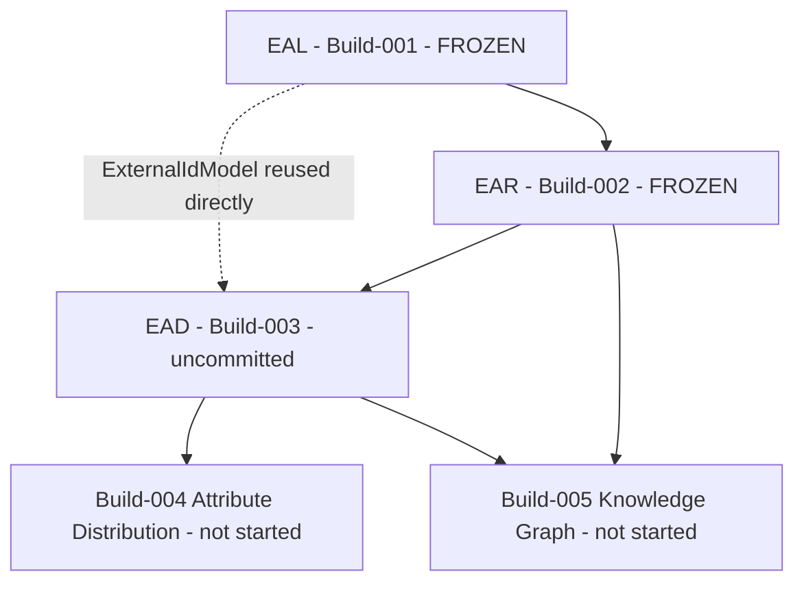
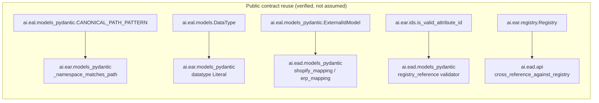
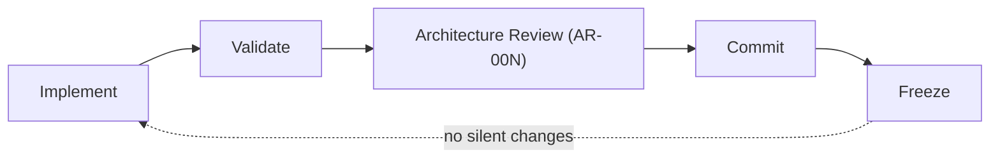

# VISIONARY IMAGE GENOME™ — Project Memory / Knowledge Transfer

Session Date: 2026-07-27
Author role: Chief Software Architect / Enterprise Architect / Technical Documentation Lead (this
session)
Purpose: A detailed technical memory allowing another engineer or AI assistant to resume
development **without relying on this conversation's history.** This is not a summary — every
claim below is either the authoritative fact itself (commit hashes, file paths, test commands) or a
direct link to the document that is. Where a link and this document could ever disagree, the link
wins.

---

# 1. Executive Summary

## What was accomplished today (2026-07-27)

In sequence:

1. **Sprint 2.0** — Governance Library (`VIG-000`..`VIG-009`) authored and self-reviewed (AR-002 =
   GO).
2. **Sprint 2.1** — Image Taxonomy Architecture authored and self-reviewed (AR-003 = GO).
3. **Build-001** — Enterprise Attribute Language (EAL) implemented, tested, self-reviewed (AR-004 =
   GO), **committed** as `fbe3931`.
4. **Enterprise Program Roadmap (EPR) v1** authored — the cross-Build sequencing document for the
   remainder of the platform.
5. **Build-002** — Enterprise Attribute Registry (EAR) implemented, tested, reviewed (AR-005 = GO),
   **committed** as `92e6485`.
6. **ADR 0005** — a naming collision was found and resolved: the next brief called Build-003
   "Enterprise Attribute Definitions," which collided with already-committed content defining
   Build-003 as "Enterprise Attribute Distribution." Resolved by renumbering (§9 below).
7. **Build-003** — Enterprise Attribute Definitions (EAD) implemented and tested. **Not yet
   committed** — awaiting Architecture Review **AR-006**.
8. **`docs/00_Foundation/FOUNDATION_v1.md`** authored — a cross-Build index/overview.
9. **This document** — the detailed session handoff.

## Overall project maturity

Foundation v1 (Builds 001–003) is architecturally complete and internally consistent, but **not
fully closed**: Build-003 has passed its own self-check and is documented, but has not yet passed a
formal Architecture Review or been committed. Nothing beyond Build-003 exists — no Knowledge Graph,
no Distribution layer, no Vision Engine structured extraction, no taxonomy content.

## Current architecture status

Three layers, one purpose each, no duplicated responsibility (detailed in §2 and §7):
`EAL` (wire format) → `EAR` (registry/identity) → `EAD` (semantic meaning). Every layer after
Build-001 reuses the ones before it directly — no reimplementation was found necessary at any
point today.

## Current repository status

```
$ git log --oneline -3
92e6485 feat(ear): Build-002 Enterprise Attribute Registry v1
fbe3931 feat(eal): Build-001 Enterprise Attribute Language v1
44b63ec docs(taxonomy): add Sprint 2.1 Image Taxonomy architecture

$ git status --short
 M docs/20_Attribute_Language/Roadmap.md
?? ai/ead/
?? docs/00_Foundation/
?? docs/30_Enterprise_Program_Roadmap/
?? docs/50_Enterprise_Attribute_Definitions/
?? docs/adr/2026-07-27-build-003-renumbering.md
```

**Uncommitted work exists.** `ai/ead/` (Build-003 code), `docs/50_Enterprise_Attribute_Definitions/`
(Build-003 docs), `docs/30_Enterprise_Program_Roadmap/` (the EPR, never yet committed at all), the
new ADR 0005, `docs/00_Foundation/` (this file and `FOUNDATION_v1.md`), and one modification to the
already-committed `docs/20_Attribute_Language/Roadmap.md` (the renumbering edit from ADR 0005) are
all sitting in the working tree, uncommitted, pending human approval and AR-006. **Do not commit
any of this without explicit instruction** — see §13 and §15.

---

# 2. Foundation Status

Foundation v1 = Build-001 + Build-002 + Build-003. Full field-level detail lives in each Build's
own specification document (linked below) — this section states purpose and responsibility only.

## Build-001 — Enterprise Attribute Language (EAL)

**Purpose**: the canonical wire format every future module exchanges attribute/relationship facts
in. **Responsibility**: defines the *shape* of one fact — `canonical_path` grammar
(`eal.<namespace>.<group>.<attribute>`), 11 canonical data types, the three-state `value_state`
(present/null/unknown), confidence (0–1), provenance, and human-verification lifecycle. **Does
not** answer whether an attribute exists elsewhere, what it means, or where it's distributed.
Spec: [EAL_SPECIFICATION.md](../20_Attribute_Language/EAL_SPECIFICATION.md).

## Build-002 — Enterprise Attribute Registry (EAR)

**Purpose**: the canonical registry of every enterprise attribute. **Responsibility**: does an
attribute exist, what's its permanent identifier (`EAR-NNNNNN`, sequential), which
namespace/module owns it, which datatype it uses — resolving EAL's `vocabulary`/`type` fields
against real content once that content exists. **Does not** carry business meaning or distribution
logic. Spec: [EAR_SPECIFICATION.md](../40_Enterprise_Attribute_Registry/EAR_SPECIFICATION.md).

## Build-003 — Enterprise Attribute Definitions (EAD)

**Purpose**: the semantic definition layer over EAR attributes. **Responsibility**: business
definition, purpose, display name, examples, Vision/AI guidance, allowed values, mapping guidance,
search behaviour, confidence expectations, and pointers (not writes) to the Knowledge Graph,
Shopify, and ERP. **Does not** write to any downstream system, implement taxonomy content, or
implement a validation engine. Spec:
[EAD_SPECIFICATION.md](../50_Enterprise_Attribute_Definitions/EAD_SPECIFICATION.md).

---

# 3. Build Timeline

| Build | Purpose | Commit hash | Architecture Review | Completion report | ADR references | Validation status |
|---|---|---|---|---|---|---|
| Build-001 | Enterprise Attribute Language (wire format) | `fbe3931` | [AR-004](../20_Attribute_Language/Architecture_Review_AR004.md) = **GO** | [BUILD_001_COMPLETION_REPORT.md](../20_Attribute_Language/BUILD_001_COMPLETION_REPORT.md) | none directly (pre-dates the ADR series' platform-layer usage) | `python -m ai.eal.test_eal` → `OK` |
| Build-002 | Enterprise Attribute Registry | `92e6485` | AR-005 = **GO** (recorded in [Enterprise Program Roadmap §9](../30_Enterprise_Program_Roadmap/Enterprise_Program_Roadmap_v1.md#section-09--architecture-gates)) | [BUILD_002_COMPLETION_REPORT.md](../40_Enterprise_Attribute_Registry/BUILD_002_COMPLETION_REPORT.md) | none directly | `python -m ai.ear.test_ear` → `OK` |
| Build-003 | Enterprise Attribute Definitions | **not committed** | Awaiting **AR-006** | [BUILD_003_COMPLETION_REPORT.md](../50_Enterprise_Attribute_Definitions/BUILD_003_COMPLETION_REPORT.md) | [ADR 0005](../adr/2026-07-27-build-003-renumbering.md) (the renumbering that created this Build's identity) | `python -m ai.ead.test_ead` → `OK` (13 checks, including a real cross-reference against `ai/ear/examples/registry.json`) |

Pre-Foundation milestones, for completeness (not part of Foundation v1 itself):

| Milestone | Review | Report |
|---|---|---|
| Sprint 2.0 — Governance Library | AR-002 = GO | [SPRINT_2_0_COMPLETION_REPORT.md](../00_Governance/SPRINT_2_0_COMPLETION_REPORT.md) |
| Sprint 2.1 — Image Taxonomy Architecture | AR-003 = GO | (no separate completion report; see [Architecture_Review_AR003.md](../10_Taxonomy/Architecture_Review_AR003.md)) |
| Vision Engine Phase 1 | AR-001 | (see `docs/AI/ARCHITECTURE_REVIEW_AR001.md`) |

---

# 4. ADR History

Every Architecture Decision Record in the repository, in order:

| ADR | Title | Purpose | Impact | Current status |
|---|---|---|---|---|
| [0001](../adr/2026-07-25-component-boundaries.md) | Component Boundaries | Define where one module's responsibility ends and another's begins | Establishes the boundary discipline every later Build (EAL/EAR/EAD) follows | Accepted |
| [0002](../adr/2026-07-25-platform-foundation-primitives.md) | Platform Foundation Primitives | Define the platform's foundational primitives | Precursor to the governance library's identifier/versioning standards | Accepted |
| [0003](../adr/2026-07-27-vision-provider-abstraction.md) | Vision Provider Abstraction | Decouple "call a vision model" from "which vision model" | `VisionProvider` ABC + `get_provider()` factory; the pattern EAL/EAR/EAD's own provider-agnostic design echoes | Accepted |
| [0004](../adr/2026-07-27-vision-identity-and-packaging.md) | Vision Engine Identity, Versioning, and Packaging Hardening | Harden `TBK_IMAGE_ID` identity and package importability | Established the content-hash identifier pattern EAL's own `compute_attribute_id` reuses | Accepted |
| [0005](../adr/2026-07-27-build-003-renumbering.md) | Build-003 Renumbering — Enterprise Attribute Definitions | Resolve the Build-003 naming collision (Definitions vs. Distribution) | Renumbered Build-003 onward; created the numbering this entire document uses | **Accepted — must never be re-litigated (see §9)** |

No ADR content is duplicated in this table — read each linked file for its full Context/Decision/
Consequences.

---

# 5. Repository Structure

```
ai/
  vision/       Vision Engine (Sprint 1) — image -> raw observation. Pre-dates Foundation v1.
  eal/          Build-001 — Enterprise Attribute Language. FROZEN.
  ear/          Build-002 — Enterprise Attribute Registry. FROZEN.
  ead/          Build-003 — Enterprise Attribute Definitions. Implemented, uncommitted.
  api/ automation/ embeddings/ knowledge/ ollama/ vectordb/
                Empty, pre-existing local folders not tracked by git and not part of any
                committed Build — do not treat as scaffolding to build into without a real
                Build assigning them a purpose first (VIG-001 Principle 4).

docs/
  00_Foundation/                         This folder. Cross-Build index/overview + session memory.
    FOUNDATION_v1.md                        Architectural overview of Builds 001-003 (see below).
    PROJECT_MEMORY_2026-07-27.md            This document.
  00_Governance/                         VIG-000..009, governance ADRs/reports (AR-002).
  10_Taxonomy/                           Sprint 2.1 image taxonomy architecture (AR-003).
  20_Attribute_Language/                 Build-001 (EAL) spec + docs (AR-004).
  30_Enterprise_Program_Roadmap/         Cross-Build sequencing (EPR v1) — uncommitted.
  40_Enterprise_Attribute_Registry/      Build-002 (EAR) spec + docs (AR-005).
  50_Enterprise_Attribute_Definitions/   Build-003 (EAD) spec + docs (awaiting AR-006).
  AI/                                    Vision Engine architecture docs (Sprint 1).
  adr/                                   Every Architecture Decision Record (§4).
  blog-os/                               A separate SEO content-factory initiative — not part
                                         of this platform; do not conflate.

Each ai/<module>/ package follows the same internal shape (established by ai/eal/, repeated by
ai/ear/ and ai/ead/):
  __init__.py            public re-exports
  models.py                dataclasses (canonical field reference, no dependencies)
  models_pydantic.py         Pydantic models (runtime validation + JSON Schema generation)
  <module-specific>.py         e.g. ids.py, registry.py/definitions.py, validation.py, loader.py,
                            exporter.py, api.py
  test_<module>.py             self-check script: regenerates schema, validates every example,
                            run via `python -m ai.<module>.test_<module>`
  schemas/<module>.schema.json  generated JSON Schema, never hand-edited
  examples/                     one or more example files per real consumer, in JSON and/or YAML
```

Note on the brief's requested folder list: this repository does **not** use top-level
`examples/`/`schemas/`/`tests/` directories — each is colocated inside its owning `ai/<module>/`
package (see above), a deliberate convention decision made during Build-002 (documented in
[EAR_SPECIFICATION.md](../40_Enterprise_Attribute_Registry/EAR_SPECIFICATION.md)'s folder-structure
section) and followed by Build-003. Do not introduce top-level versions of these folders.

---

# 6. Dependency Graph

```
EAL (Build-001, wire format)
  ↓ (EAR reuses EAL's canonical-path grammar, datatype list, namespace-matching logic)
EAR (Build-002, registry / identity)
  ↓ (EAD reuses EAR's ID format + Registry class, and EAL's ExternalIdModel)
EAD (Build-003, semantic definitions)
  ↓ (mapping guidance consumed by, but not written by, EAD itself)
Build-004 (Attribute Distribution — not started)
```





No cyclic dependency exists anywhere in this graph — every arrow runs from an earlier Build to a
later one, matching the acyclicity already verified in the
[Enterprise Program Roadmap §8](../30_Enterprise_Program_Roadmap/Enterprise_Program_Roadmap_v1.md#section-08--dependency-graph).

---

# 7. Frozen Public Interfaces

These interfaces are load-bearing (at least one later Build already imports them directly) and
**must not change** without an ADR and a full downstream-impact review:

| Interface | Defined in | Frozen because |
|---|---|---|
| **Canonical Path** grammar (`eal.<namespace>.<group>.<attribute>`, `CANONICAL_PATH_PATTERN`) | `ai/eal/models_pydantic.py` | Imported directly by EAR (namespace validation) and referenced by EAD's `registry_reference` chain |
| **Attribute IDs** (`compute_attribute_id`, `EAL-<hash>` format) | `ai/eal/models.py` / `ai/eal/ids` logic in `models.py` | Every EAL record's identity; EAR's `eal_reference` field points at these |
| **Relationship IDs** (`compute_relationship_id`, `EAL-REL-<hash>`) | `ai/eal/models.py` | Every EAL relationship record's identity |
| **Registry UUIDs** (`compute_registry_uuid`, uuid5-derived) | `ai/ear/ids.py` | EAR's internal identity; distinct namespace UUID from EAD's, by design (never collide even on same input) |
| **Attribute IDs (EAR)** (`allocate_attribute_id`, sequential `EAR-NNNNNN`) | `ai/ear/ids.py` | The one external, human-readable identifier EAD's `registry_reference` field points at |
| **Definition IDs** (`compute_definition_id`, uuid5-derived) | `ai/ead/ids.py` | EAD's own identity; derived from `registry_reference`, not independently allocated |
| **Validation interfaces** — `EALAttributeRecordModel`, `EARAttributeEntryModel`, `EADDefinitionModel` (Pydantic classes) | `ai/eal/models_pydantic.py`, `ai/ear/models_pydantic.py`, `ai/ead/models_pydantic.py` | Every downstream consumer validates against these classes directly, not a reimplementation |
| **Metadata models** — `Provenance`, `HumanVerification` (EAL); `metadata: dict` (EAR/EAD) | `ai/eal/models.py` | Confidence/provenance/verification lineage every record carries |
| **External IDs** — `ExternalIdModel` (`system`/`id_type`/`value`) | `ai/eal/models_pydantic.py` | Reused verbatim by EAD's `shopify_mapping`/`erp_mapping` — the one join mechanism to Shopify/ERP anywhere in the platform |
| **Confidence model** — `float`, range `[0.0, 1.0]`, `None` when not meaningful | `ai/eal/models_pydantic.py` (`Field(ge=0.0, le=1.0)`), reused identically in EAR and EAD (`ConfidenceExpectationsModel`) | One confidence scale platform-wide, no per-module reinterpretation |
| **Null handling** — three-state `value_state`: `present`/`null`/`unknown` | `ai/eal/models.py`, `ai/eal/models_pydantic.py` (`_value_state_consistency`) | The distinction between "doesn't apply" and "not yet known" — load-bearing for every attribute record |
| **Namespace conventions** — `core` \| `domain.<name>`, cross-validated against the canonical path | `ai/eal/models_pydantic.py` (`_namespace_matches_path`), reused identically by EAR (`_namespace_matches_eal_reference`) | Two-tier namespace split every Domain (Bakery, future Flowers/Gifts/etc.) relies on |

**Rule going forward**: any change to a row above requires (a) a new ADR explaining why, (b) a
review of every "reused by" consumer listed, and (c) is out of scope for any Build that isn't
explicitly reviewing that interface.

---

# 8. Validation

Every validation actually executed today, with results — not a description of what validation
*should* exist:

## Test suites

```
$ python -m ai.eal.test_eal
OK
$ python -m ai.ear.test_ear
OK
$ python -m ai.ead.test_ead
OK
```

`ai/ead/test_ead.py` (13 checks) includes a **real cross-reference validation**: it loads the
actual `ai/ear/examples/registry.json` via `ai.ear.loader.load_registry` and confirms every EAD
example's `registry_reference` resolves against it — proving Build-002/Build-003 integrate without
either modifying the other, not asserting it.

## Cross-reference validation (documentation links)

Every `[text](path)` markdown link across each doc tree was script-checked (relative-path
resolution against the actual filesystem) after every authoring/editing pass:

- `docs/20_Attribute_Language/*.md` — 0 broken links (checked at Build-001 and again after the
  Build-003 renumbering edit).
- `docs/40_Enterprise_Attribute_Registry/*.md` — 0 broken links.
- `docs/50_Enterprise_Attribute_Definitions/*.md` — 0 broken links.
- `docs/30_Enterprise_Program_Roadmap/*.md` — 0 broken links (checked after the renumbering pass).
- `docs/00_Foundation/*.md` — 0 broken links.

(A small number of literal `[text](path)` strings appearing inside prose describing this very
sweep method are correctly flagged by the script and are not real broken links — confirmed by
inspection each time.)

## Repository validation

```
$ git status --short
 M docs/20_Attribute_Language/Roadmap.md
?? ai/ead/
?? docs/00_Foundation/
?? docs/30_Enterprise_Program_Roadmap/
?? docs/50_Enterprise_Attribute_Definitions/
?? docs/adr/2026-07-27-build-003-renumbering.md
```

Confirmed after every Build: no file under `ai/eal/` or `ai/ear/` was ever modified by a later
Build's implementation work (only `docs/20_Attribute_Language/Roadmap.md` — a documentation file,
not code — was touched, and only for the ADR-0005 renumbering, never for Build-002 or Build-003's
own implementation).

## Schema validation

Every module's `regenerate_schema()` was run as part of its own test suite, regenerating
`ai/eal/schemas/*.schema.json`, `ai/ear/schemas/ear.schema.json`, and `ai/ead/schemas/ead.schema.json`
directly from the live Pydantic models — these files can never drift from the code that defines
them, by construction (they are overwritten on every test run, never hand-edited).

## Regression validation

`ai/eal/test_eal.py::test_example_ids_match_computed_ids` and `ai/ear/test_ear.py::
test_example_ids_match_computed_ids` and `ai/ead/test_ead.py::test_example_definition_ids_match_computed`
each assert that every example file's stored identifier still matches a fresh recomputation from
its own inputs — a permanent regression guard against silent example/example drift, first added
during Build-001's AR-004 review and proactively repeated in Build-002 and Build-003 rather than
waiting to be re-discovered.

---

# 9. Build Renumbering

Full detail: **[ADR 0005](../adr/2026-07-27-build-003-renumbering.md)** — this section is a pointer
and summary, not a restatement.

**What happened**: Build-003 was originally committed (via `docs/20_Attribute_Language/Roadmap.md`
and the Enterprise Program Roadmap, both reviewed at AR-005) as "EAD: Enterprise Attribute
Distribution." The next implementation brief named Build-003 "Enterprise Attribute Definitions" —
a different responsibility under the same number and the same "EAD" initialism.

**Why Distribution became Build-004**: renumbering, not redefinition. Enterprise Attribute
Definitions took the Build-003 slot; Enterprise Attribute Distribution and every Build after it
shifted up by exactly one (Build-004 = Distribution, Build-005 = Knowledge Graph, ... Build-011 =
Production Release). This was independently confirmed to be the *more* consistent outcome: `ai/ear/`'s
own code and docs already described "Build-003 (EAD)" as the business-definitions module before
this decision was made — the renumbering made already-frozen references correct rather than
requiring them to be edited.

**Why this must never be changed again**: every document written since (the Enterprise Program
Roadmap, `docs/20_Attribute_Language/Roadmap.md`, `FOUNDATION_v1.md`, this document, Build-003's
entire doc set) uses the post-renumbering scheme as ground truth. A second renumbering would
invalidate cross-references across five-plus documents and both completion reports, with no
compensating benefit — the collision that justified the *first* renumbering (a genuine, unavoidable
naming conflict) does not recur. Any future Build-numbering conflict must be resolved by inserting
new numbers going forward (as Build-004 through Build-011 already do), never by renumbering
Build-001 through Build-003 again.

---

# 10. Remaining Roadmap

Full detail, objectives, dependencies, and Architecture Gates:
[Enterprise Program Roadmap §7](../30_Enterprise_Program_Roadmap/Enterprise_Program_Roadmap_v1.md#section-07--build-roadmap).
Current intended purpose only, not redesigned here:

| Build | Purpose |
|---|---|
| Build-004 | Enterprise Attribute Distribution — the write path from validated attributes to Shopify metafields and ERP attribute codes |
| Build-005 | Knowledge Graph — physical storage implementation, the actual system of record |
| Build-006 | Master Image Taxonomy content (Sprint 2.2) — real Bakery Category/Attribute/Vocabulary content |
| Build-007 | Vision Engine structured extraction (Sprint 2.3) — real prompt/schema content, Observation → Attribute parsing |
| Build-008 | Embeddings + Vector Search |
| Build-009 | ERP + Shopify Distribution at volume (hardening Build-004) |
| Build-010 | JARVIS integration (first AI Agent consumer) |
| Build-011 | Production Release v1.0 |

---

# 11. Technical Debt

Every deferred item, why, and when to revisit — none of these are oversights, each is an explicit,
documented deferral:

| Item | Why deferred | When to address |
|---|---|---|
| EAL: AI-derived ⇒ `confidence` set is not cross-field-enforced | Only the range check is live; no live registry existed to justify more at Build-001 | Now addressable — Build-002 (EAR) exists; revisit if a future EAR/validation pass targets it explicitly |
| EAL: `enum` ⇒ `vocabulary` set/resolves is not cross-field-enforced | No Vocabulary registry existed at Build-001 | Build-006 (Sprint 2.2 taxonomy content) + a future Build-002 extension |
| EAR: `taxonomy_references` not validated against real content | Sprint 2.2 hasn't authored real taxonomy yet | Build-006 |
| EAR: relationship `type` not validated against a live vocabulary | Same — no registry to validate against | Build-006 + a future EAR extension |
| EAR: no controlled unit vocabulary | No measurement-typed attribute exists yet in any example | When the first measurement attribute is authored |
| EAD: `allowed_values` not validated against a real Controlled Vocabulary | Sprint 2.2 hasn't authored one yet | Build-006 |
| EAD: `knowledge_graph_reference` stays `null` | Knowledge Graph (Build-005) doesn't exist yet | Build-005 |
| EAD: no validation engine implemented | Out of Build-003's explicit scope; WS-07 is a separate workstream | Whenever WS-07 is scheduled |
| No enforcement mechanism beyond review discipline (flagged since AR-002) | Introducing lint/CI gates with only 1-3 real modules to check compliance against would be process for its own sake | Revisit once a fourth or fifth real module exists |
| Category-tree query performance at scale (flagged since AR-003) | A storage/query-implementation decision, correctly deferred to whichever Build selects the Knowledge Graph's physical technology | Build-005, explicitly — must be decided there, not deferred a third time |

---

# 12. Risks

**Architectural**: Build-004 (Distribution) needs a real place to read "what changed" from, but
Build-005 (Knowledge Graph) may not exist yet when Build-004 starts — mitigated by allowing
Build-004's first round-trip test to run against a stub/flat-file source (see
[Enterprise Program Roadmap, Risk R-2](../30_Enterprise_Program_Roadmap/Enterprise_Program_Roadmap_v1.md#section-12--risk-register)).

**Future scaling**: Category-tree traversal at volume is an acknowledged, not-yet-fixed risk
(AR-003) that Build-005/AR-008 must decide explicitly, not defer again. Attribute/Domain count
growth is structurally addressed (two-tier group split, additive-only inheritance) and verified,
not just assumed, per AR-003.

**Dependency**: TBK Kitchen ERP's actual write API is unknown to this platform until a first-contact
inspection happens — Build-004 cannot be scoped precisely before that (Risk R-3). n8n and Google
Services are external systems this platform depends on for orchestration/review-sourcing but does
not control uptime for — both are consumers/sources, never the system of record, so an outage
degrades convenience, not data integrity (Risk R-11).

**Documentation**: five-plus documents now depend on the post-renumbering Build sequence being
stable (§9) — any future renumbering would be materially more expensive than this one was. This
document, `FOUNDATION_v1.md`, and every completion report are all snapshots; only the Enterprise
Program Roadmap and each module's own spec are living documents expected to stay current — a reader
should always prefer those over a dated snapshot for "what's true right now."

**Operational**: a future AI Agent (JARVIS, Build-010) attempting to publish or override a gate
autonomously is explicitly guarded against by the agent-authority principle in
[Enterprise Program Roadmap §04](../30_Enterprise_Program_Roadmap/Enterprise_Program_Roadmap_v1.md#section-04--implementation-principles)
— Build-010 scopes JARVIS to read/draft only from day one.

---

# 13. Known Constraints

Standing project rules that govern every session, not just today's:

- **Do not duplicate code.** Every new Build reuses the prior Builds' models/validators/IDs
  directly (imports, not copies) — verified in §7's interface table.
- **Reuse EAL.** Canonical-path grammar, datatype list, `ExternalIdModel`, confidence range — never
  redefine.
- **Reuse EAR.** ID format validation, the `Registry` class — never reimplement.
- **Reuse EAD.** Once Build-004 begins, its mapping guidance comes from EAD's `shopify_mapping`/
  `erp_mapping`, not a new lookup.
- **No silent architecture changes.** The Build-003 renumbering (§9) is the model: found, flagged
  to the user, decided explicitly, recorded in an ADR — never applied quietly.
- **Everything requires an ADR** for any decision that changes an established interface, naming
  scheme, or numbering sequence (VIG-009, one-decision-one-document).
- **Human approval before commits.** Build-001 and Build-002 were only committed after explicit
  human instruction ("Commit and freeze Build-002"); Build-003 remains uncommitted pending the same.
- **Architecture reviews before freezing.** No Build is considered done until its Architecture Gate
  (AR-00N) returns GO — Build-003 is implemented but explicitly **not** frozen until AR-006 closes.

---

# 14. Repository Governance

The engineering workflow this session followed, and every future session should follow:

```
Implement
   ↓
Validate        (module self-check: python -m ai.<module>.test_<module> → OK)
   ↓
Architecture Review   (AR-00N: self-review + human/external review; GO/No-Go)
   ↓
Commit          (only after explicit human instruction, scoped to exactly the reviewed Build)
   ↓
Freeze          (no further modification without a new ADR)
```



Build-001 and Build-002 completed this full cycle. Build-003 is currently sitting between
**Validate** and **Architecture Review** — implemented and self-tested, not yet reviewed, not yet
committed, not yet frozen.

---

# 15. Tomorrow's Starting Point

**Foundation v1 is architecturally complete.** Build-001 (EAL) and Build-002 (EAR) are frozen and
committed. Build-003 (EAD) is implemented, tested, and documented, but **not yet frozen** — it is
awaiting Architecture Review AR-006 and, after that, an explicit human instruction to commit.

**Next Build: Build-004 — Enterprise Attribute Distribution.**

**Do NOT start Build-004 implementation tomorrow without explicit new instruction.** The correct
first actions tomorrow, in order:

1. Obtain or perform Architecture Review **AR-006** for Build-003 (Enterprise Attribute
   Definitions) — the one open item blocking Foundation v1 from being fully closed.
2. On AR-006 = GO, commit Build-003 exactly as Build-001 and Build-002 were committed (scoped
   `git add` of only `ai/ead/` and `docs/50_Enterprise_Attribute_Definitions/`, following this
   session's own commit-message convention) — **only on explicit human instruction to do so.**
3. Decide, separately, whether to commit the still-uncommitted Enterprise Program Roadmap
   (`docs/30_Enterprise_Program_Roadmap/`) and this `docs/00_Foundation/` tree — these were
   deliberately left uncommitted in prior sessions pending the user's own scoping decisions; do not
   assume they should be bundled into the Build-003 commit.
4. Only after Build-003 is reviewed and (if approved) committed should a new implementation brief
   for Build-004 be requested and acted on. Do not pre-emptively scaffold `ai/` folders for
   Build-004, Build-005, or any later Build (VIG-001 Principle 4).

---

# 16. Lessons Learned

**What worked well**: reusing frozen contracts directly (EAL's `ExternalIdModel`, EAR's ID
validation and `Registry` class) rather than reimplementing meant Build-003 required zero changes
to either prior Build, and its test suite could prove real integration (a genuine cross-reference
check against `ai/ear/examples/registry.json`) instead of a synthetic one. Grounding every new
document in an Explore pass over existing frozen material (before writing anything) caught the
Build-003 naming collision *before* it was silently baked into new code — cheaper to fix as a
renumbering than it would have been to discover after Build-004 also used "EAD" ambiguously.

**Mistakes avoided**: the original brief for Build-003 would have created a second, conflicting
meaning for "EAD" under the same Build number, had the collision not been surfaced and resolved via
ADR before any code was written. Committing work was never assumed — every commit this session was
gated on an explicit human instruction, matching this repository's own git-safety conventions.

**Architecture improvements made this session**: the `test_example_ids_match_computed_ids` /
`test_example_registry_uuids_match_computed` / `test_example_definition_ids_match_computed` pattern
— a permanent regression assertion that an example's stored identifier still matches a fresh
recomputation — was discovered as a gap during Build-001's AR-004 review, fixed there, and then
proactively added to Build-002 and Build-003 *before* being independently rediscovered, rather than
waiting for each Build's own review to find it fresh.

---

# 17. Definition of Done

Foundation v1 is considered **architecturally** complete for the following reasons — see
[FOUNDATION_v1.md §10](FOUNDATION_v1.md#10-definition-of-done-for-foundation-v1) for the full
rollup:

1. Build-001 and Build-002 are implemented, tested, reviewed (GO), and committed.
2. Build-003 is implemented, tested (`OK`, 13 checks including a real EAR cross-reference), and
   documented.
3. No frozen layer was modified by a later Build — verified by `git status` after every Build.
4. Every public contract in §7 has at least one real consumer outside its own module, proving the
   contracts are load-bearing, not speculative.
5. The one naming collision found (§9) was resolved transparently, recorded in an ADR, and
   propagated consistently across every affected document.

Foundation v1 is **not fully done** — item 2's Architecture Review (AR-006) and subsequent commit
are still open. This document, like `FOUNDATION_v1.md`, describes the frozen *shape* Foundation v1
has reached, not a claim that every step has closed.

---

# 18. AI Handoff Notes

## For Claude Code / future sessions of this assistant

Read `docs/00_Foundation/FOUNDATION_v1.md` first (architectural index), then this document (session
memory) if you need today's specific decisions and rationale. Before writing any new Build's code,
grep the repository for the terms you're about to introduce (a Build name, an acronym, an AR/ADR
number) — the exact collision this session hit (§9) is avoidable by doing this first. Never modify
`ai/eal/` or `ai/ear/` (frozen); treat `ai/ead/` as frozen too once AR-006 passes and it is
committed. Never commit without an explicit human instruction naming the scope. Never renumber
Build-001 through Build-003 again (§9) — insert new numbers going forward instead.

## For ChatGPT (external Architecture Reviewer)

Your review authority in this project is the Architecture Gate itself (AR-00N) — this session's
convention is that AR-005 and earlier were reviewed by you, and Build-003 is currently awaiting your
AR-006 review. Review inputs: `ai/ead/` code, `docs/50_Enterprise_Attribute_Definitions/*.md`, and
this document plus `FOUNDATION_v1.md` for context. Approval criteria are stated in the
[Enterprise Program Roadmap §9](../30_Enterprise_Program_Roadmap/Enterprise_Program_Roadmap_v1.md#section-09--architecture-gates)
gate table's AR-006 row.

## For Codex / other AI coding assistants

Follow the same package-shape convention every `ai/<module>/` already uses (§5) — do not introduce
a different file layout for a new module. Reuse frozen interfaces (§7) by import, never by copying
field definitions. If a new Build's brief appears to redefine an existing Build number or
initialism, stop and flag it before writing code — do not silently reinterpret or silently rename.

## For future human engineers

Nothing in this platform is deployed or connected to production systems yet — everything described
here is architecture, code, and documentation only, with self-contained test suites and no external
service dependency. The safest way to resume work is to run all three test suites (`python -m
ai.eal.test_eal`, `python -m ai.ear.test_ear`, `python -m ai.ead.test_ead`) to confirm the frozen
state still holds, read §15 above, and proceed from there.
