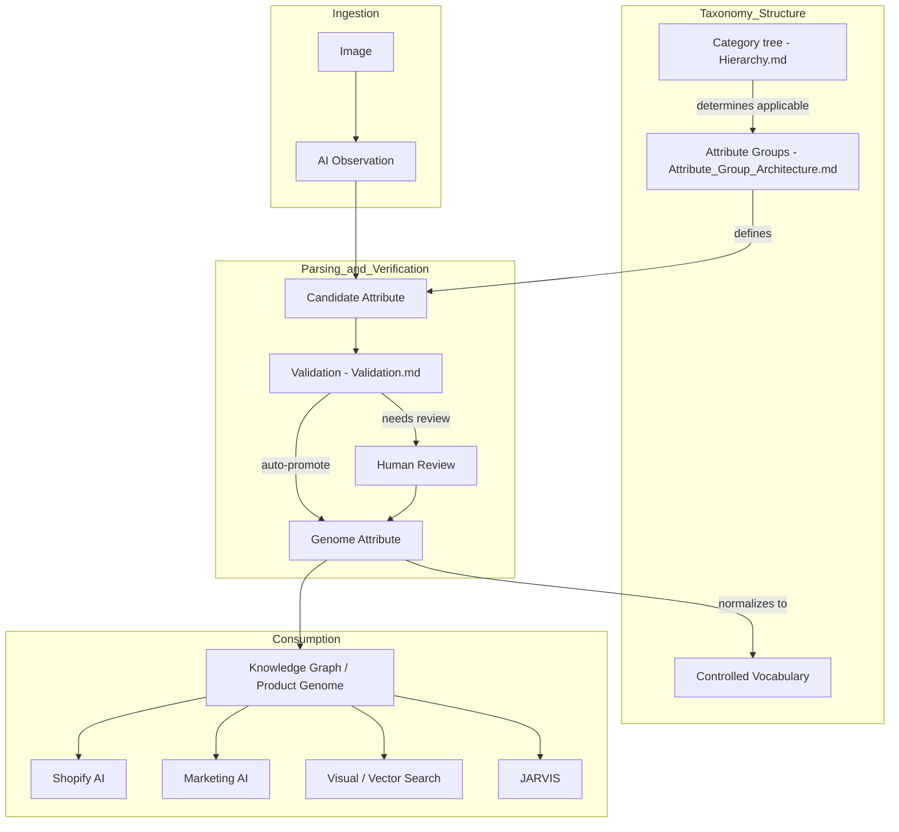
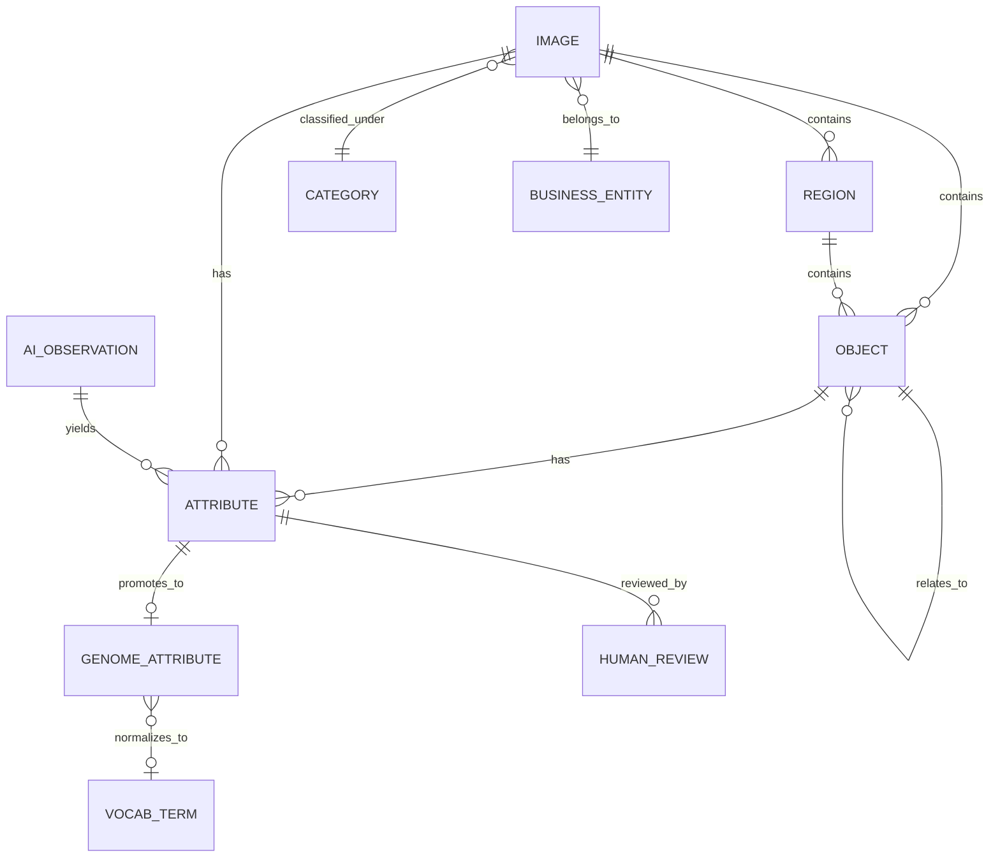
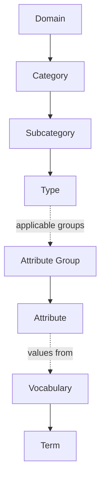

# Image Taxonomy — Architecture Overview

Sprint 2.1. This document is the entry point to the taxonomy architecture — an index and diagram
set. Each subject has exactly one authoritative home (per
[VIG-008](../00_Governance/VIG-008-Documentation-Standard.md)); this file summarizes and links out,
it does not restate.

## Executive Summary

Sprint 2.1 designs the architecture the Master Image Taxonomy will be authored against — not the
taxonomy itself. The design's core scalability decision is a two-tier Attribute Group split
(platform-level groups defined once and shared by every domain forever; domain-level groups
attached per Category and extended additively) combined with additive-only inheritance and
identifier-stable hierarchies. Together these mean growing from 500 to 5,000+ attributes, or adding
an entirely new industry domain, is always an *addition* to this structure — never a redesign of
it. See [Architecture_Review_AR003.md](Architecture_Review_AR003.md) for the self-review and
readiness verdict.

## Document Map

| Document | Covers |
|---|---|
| [Entity_Model.md](Entity_Model.md) | Core entities: Image, Region, Object, Attribute, Genome Attribute, AI Observation, Human Review, Category, Attribute Group, Controlled Vocabulary Term, Relationship, Business Entity. |
| [Hierarchy.md](Hierarchy.md) | The three independent hierarchies: Category, Attribute Group, Controlled Vocabulary. |
| [Attribute_Group_Architecture.md](Attribute_Group_Architecture.md) | The platform-level vs. domain-level group split — the core scalability mechanism. |
| [Inheritance.md](Inheritance.md) | Additive-only inheritance rule and the domain-extension pattern. |
| [Relationship_Model.md](Relationship_Model.md) | Typed edges between entities — the Knowledge Graph's logical schema. |
| [Controlled_Vocabulary.md](Controlled_Vocabulary.md) | Term structure, normalization, growth, deprecation. |
| [Versioning.md](Versioning.md) | Applies VIG-005 to the taxonomy's own artifacts (tree, groups, vocabularies). |
| [Validation.md](Validation.md) | Four-dimension validation strategy feeding the VIG-007 verification gate. |
| [Roadmap.md](Roadmap.md) | Sprint 2.2+ (authoring the real Bakery taxonomy) and future domains. |
| [Architecture_Review_AR003.md](Architecture_Review_AR003.md) | Independent self-review of this architecture. |

## Architecture Diagram



## Entity Diagram



## Hierarchy Diagram



## Folder Structure

```
docs/10_Taxonomy/
  Architecture.md                    (this file)
  Entity_Model.md
  Hierarchy.md
  Attribute_Group_Architecture.md
  Inheritance.md
  Relationship_Model.md
  Controlled_Vocabulary.md
  Versioning.md
  Validation.md
  Roadmap.md
  Architecture_Review_AR003.md
```

No `docs/10_Taxonomy/vocabularies/` or `docs/10_Taxonomy/categories/` content folders are created in
this sprint — those hold real taxonomy *content*, which Sprint 2.2 authors, not this architecture
pass ([VIG-001](../00_Governance/VIG-001-Platform-Principles.md) Principle 4: structure follows a
real implementation, not in advance of one).

## Related Standards

This entire document set implements
[VIG-000](../00_Governance/VIG-000-Constitution.md) Principles 5, 6, 9, 10 (taxonomy authority,
system of record, versioning, normalized consumption),
[VIG-001](../00_Governance/VIG-001-Platform-Principles.md),
[VIG-002](../00_Governance/VIG-002-Architecture-Principles.md),
[VIG-003](../00_Governance/VIG-003-Data-Principles.md),
[VIG-005](../00_Governance/VIG-005-Versioning-Standard.md),
[VIG-006](../00_Governance/VIG-006-Identifier-Standard.md), and
[VIG-007](../00_Governance/VIG-007-Quality-Standard.md) — no governance rule is duplicated here;
each document above cites the specific VIG principle(s) it applies.
