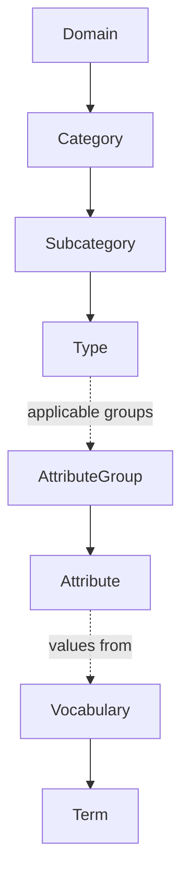

# Image Taxonomy — Hierarchy

Sprint 2.1. Defines the three hierarchies the taxonomy is organized around: Category, Attribute
Group, and Controlled Vocabulary. These are independent trees that reference each other, not one
merged hierarchy — conflating them is what causes taxonomy redesigns at scale.

## 1. Category Hierarchy

Classifies *what an Image or Object is*.

```
Domain               (Bakery, Flowers, Gifts, ...)
  └─ Category           (Cakes, Bouquets, Hampers, ...)
       └─ Subcategory      (Birthday Cakes, Anniversary Cakes, ...)
            └─ Type           (Character Cakes, Photo Cakes, Number Cakes, ...)
```

- **Domain** is the top-level industry scope. Bakery exists today; Flowers, Gifts, Packaging,
  Balloons, Merchandise, Chocolate, Cookies, Brownies, Pastries are named future domains — each is
  a new subtree, never a modification of an existing one.
- A Category node may have any number of children and any depth is permitted below Subcategory —
  the model does not fix the tree at exactly four levels; Domain/Category/Subcategory/Type is the
  common case, not a hard limit.
- Every Category node carries a stable identifier (its own `TBK_*_ID`-style key, per
  [VIG-006](../00_Governance/VIG-006-Identifier-Standard.md)) independent of its position in the
  tree, so re-parenting a node (moving Photo Cakes under a new Subcategory) never breaks references
  to it.

## 2. Attribute Group Hierarchy

Classifies *what kind of description an Attribute is*. See
[Attribute_Group_Architecture.md](Attribute_Group_Architecture.md) for the full group list and the
platform-level vs. domain-level split.

```
Attribute Group          (Colour, Decoration, Occasion, System, ...)
  └─ Attribute              (primary_colour, decoration_type, ...)
       └─ Value                 (a Controlled Vocabulary Term, a free-text string, or a number/enum)
```

- Attribute Groups are attached to Category nodes (see [Inheritance.md](Inheritance.md)) — a
  Category determines which Attribute Groups are *applicable*, not which values an Attribute holds.
- An Attribute always belongs to exactly one Attribute Group. No Attribute is defined free-floating
  outside a group — this is what keeps "thousands of attributes" navigable rather than a flat,
  unstructured list.

## 3. Controlled Vocabulary Hierarchy

Classifies *the valid values an Attribute can take*, where a controlled vocabulary applies. See
[Controlled_Vocabulary.md](Controlled_Vocabulary.md).

```
Vocabulary                (Shape, Colour Name, Occasion, ...)
  └─ Term                    (Round, Square, Heart-shaped, ...)
       └─ Synonym / Alias       (free-text observations normalize onto a Term)
```

A vocabulary may itself be a shallow hierarchy (e.g. "Red" as a parent Term with "Maroon", "Crimson"
as child Terms) where that helps similarity search and grouping — this is a vocabulary-specific
design choice, not mandated globally.

## How the three hierarchies relate

A **Category** determines which **Attribute Groups** apply (Inheritance.md). Each **Attribute**
within a group may reference a **Controlled Vocabulary** for its valid values. None of the three
hierarchies encodes the others — a Category never hardcodes a specific Attribute value, and a
Controlled Vocabulary Term never hardcodes which Category it's valid for (a "Round" shape Term is
reusable across Cakes, Cookies, and any future domain with round objects).



## Why three hierarchies, not one

A single merged tree (e.g. "Birthday Cakes > Round > Red" as one path) would mean every new
attribute combination requires a new tree node — the exact redesign-on-growth problem Sprint 2.1's
success criterion (500/1000/3000/5000+ attributes without redesign) exists to avoid. Separating
"what it is" (Category) from "what kind of description" (Attribute Group) from "what value" (Term)
means adding the 5,000th attribute is adding one row to one table, not restructuring a tree three
other things depend on.

## Related Standards

Implements [VIG-000](../00_Governance/VIG-000-Constitution.md) Principle 5 (taxonomy is
authoritative), [VIG-002](../00_Governance/VIG-002-Architecture-Principles.md) Principle 4 (minimum
viable structure — hierarchies grow by addition, not restructuring).
