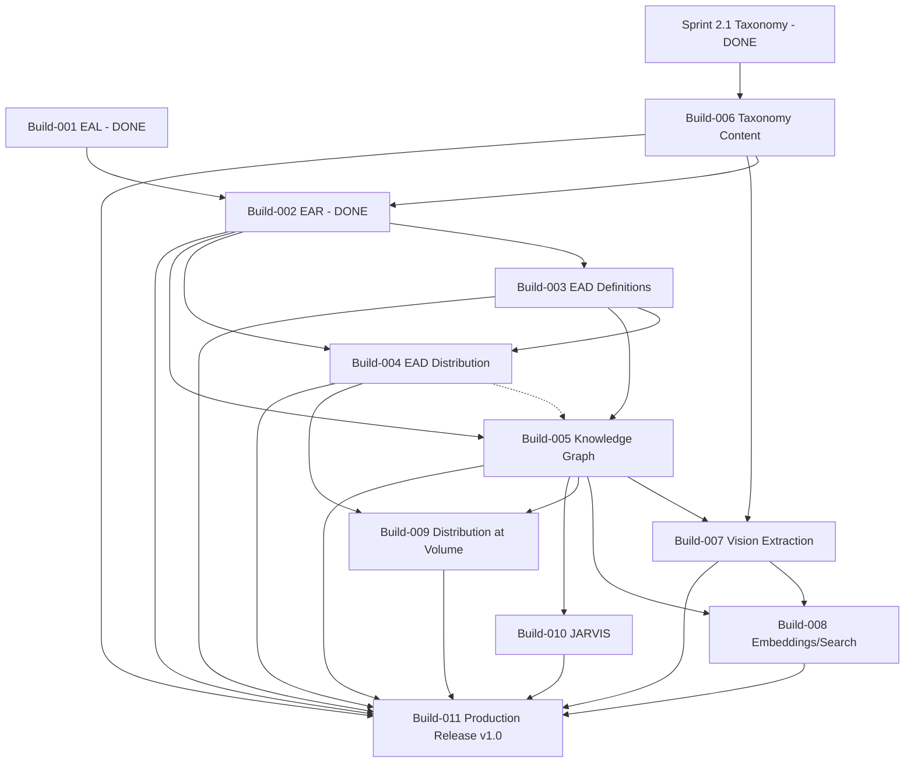
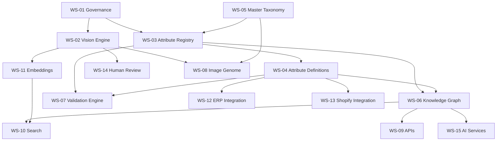
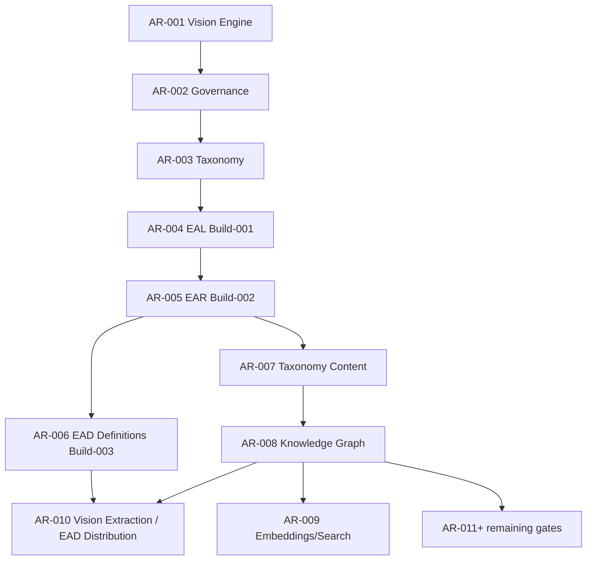

# VISIONARY IMAGE GENOME™ — Enterprise Program Roadmap (EPR) v1.0

Date: 2026-07-27
Status: AR-005 passed — Build-002 (EAR) committed. **Renumbered 2026-07-27** per
[docs/adr/2026-07-27-build-003-renumbering.md](../adr/2026-07-27-build-003-renumbering.md):
Build-003 is now Enterprise Attribute Definitions (EAD); the originally-numbered Build-003
(Enterprise Attribute Distribution) and every build after it shifted up by one. Build-003 is in
progress, awaiting **AR-006**.

This is the governing implementation blueprint for the remainder of VISIONARY IMAGE GENOME™ — the
enterprise AI Product Intelligence Platform, of which **Cake Genome™** is version 1. It supersedes
no existing document; it is the first document that unifies what `docs/AI/Roadmap.md`,
`docs/10_Taxonomy/Roadmap.md`, and `docs/20_Attribute_Language/Roadmap.md` each already state for
their own layer into one cross-layer sequence. Where this document and any of those three disagree,
**those three win** — they are the authoritative, already-reviewed source for their own layer; this
document only sequences and connects them.

**Not the same program as** the root-level `PROJECT_ROADMAP.md` (the Shopify storefront theme
rebuild, Phases A–K). That program transforms the customer-facing store; this program builds the
AI/data platform behind the catalogue. They share a Shopify store as one integration point
(Section 14) and nothing else. Do not merge their phase/build numbering.

---

## Section 01 — Executive Summary

### Mission

Transform product images into structured, governed, machine- and human-usable business
intelligence — starting with cake photographs, generalizing to any physical product a camera can
see.

### Vision

One reusable platform (the Enterprise Product Genome Framework, EPGF — Section 02) that any product
domain can plug into by adding a Domain under the existing taxonomy extension pattern
(`docs/10_Taxonomy/Inheritance.md`), never by redesigning the platform. Cake Genome™ proves the
model for Bakery; Flowers, Chocolates, Hampers, and beyond follow the same path, on demand, never
ahead of it.

### Business Objectives

1. Turn today's catalogue images — the store's single largest untapped data asset — into
   structured attributes usable for SEO/GEO, merchandising, search, and recommendation.
2. Give every attribute a traceable, provenance-carrying, human-verifiable lineage, so AI-derived
   catalogue data is trustworthy enough for GEO citation and compliance review (`CLAUDE.md`'s
   "never invent" golden rules, generalized platform-wide by VIG-007).
3. Make the platform reusable to a second product domain without a second platform.

### Technical Objectives

1. Ship the wire format (done — Build-001/EAL), the registry that gives it real vocabulary content
   (done — Build-002/EAR), the semantic definition layer over it (in progress — Build-003/EAD
   Definitions), and the distribution layer that gets validated attributes into Shopify/ERP
   (Build-004/EAD Distribution), on the schedule in Section 07.
2. Stand up the Knowledge Graph as the actual system of record VIG-003 already mandates
   (Build-005+), so Product Genome stops being a governance concept and becomes a queryable thing.
3. Wire the Vision Engine's real extraction (Sprint 2.3) against a real, authored taxonomy
   (Sprint 2.2) — closing the loop from "a photo exists" to "a verified attribute exists."

### Success Metrics

- Structural: the platform absorbs growth from 500 to 5,000+ attributes and from one Domain
  (Bakery) to at least one more (any of Flowers/Gifts/Packaging/Balloons/Merchandise/Chocolate/
  Cookies/Brownies/Pastries, already named in `docs/10_Taxonomy/Roadmap.md`) with **zero redesign**
  — this is Sprint 2.1's own stated success criterion, inherited here rather than restated.
- Operational: every attribute reaching a downstream system (Shopify metafield, ERP code) carries
  confidence + provenance + human-verification status (VIG-007), with zero fabricated values
  (CLAUDE.md golden rule, VIG-007 Principle).
- Delivery: every Build in Section 07 passes its Architecture Gate (Section 09) before the next
  Build starts — no Build ships un-reviewed, matching the AR-001→002→003→004→005 track record.

### Expected Business Value

Fewer manual hours per product listing (attribute extraction becomes AI-assisted, not
manually typed per SKU), a queryable Knowledge Graph that downstream Marketing/Search/JARVIS
modules can consume without each reinventing extraction, and a defensible, source-linked data
trail for every GEO-citable catalogue fact — directly extending this repo's existing
"verifiability beats persuasion" standing principle (`CLAUDE.md`).

---

## Section 02 — Platform Overview

### VISIONARY IMAGE GENOME™

The platform name, canonical per `VIG-000-Constitution.md`. It is the umbrella brand for every
module VIG-000 already lists as in its future scope: Vision Engine, Cake Genome, Knowledge Graph,
Embedding Engine, Vector Search, Visual Search, Shopify AI, SEO AI, Marketing AI, JARVIS, ERP AI,
CRM AI, Business Intelligence.

### Enterprise Product Genome Framework (EPGF)

The reusable core: Vision Engine + EAL wire format + Attribute Registry + Attribute Definitions +
Knowledge Graph + Validation Engine, none of which name a product category. This is what makes a
"Genome" concept generic rather than bakery-specific — the two-tier Attribute Group split
(`docs/10_Taxonomy/Attribute_Group_Architecture.md`) already separates platform-level groups
(shared forever) from domain-level groups (one subtree per industry), which is exactly what makes
EPGF and Cake Genome two different things rather than one.

### Cake Genome™

EPGF's first concrete instance: the Bakery Domain's Category tree, Attribute Groups, and
Controlled Vocabularies, authored in Sprint 2.2 against Sprint 2.1's architecture. Cake Genome is
*content*; EPGF is the *framework that content is authored against*.

### Future Product Genomes

Flowers, Gifts, Packaging, Balloons, Merchandise, Chocolate, Cookies, Brownies, Pastries — already
named in `docs/10_Taxonomy/Roadmap.md` as future Domains, unscheduled, added only on real business
need (VIG-001 Principle 4). Each becomes its own "Genome" (e.g. "Flower Genome") the same way Cake
Genome was: a new Domain namespace under the existing extension pattern, zero changes to EPGF core,
zero changes to any other Genome's data.

### Ownership and responsibilities

| Layer | Owns | Does not own |
|---|---|---|
| EPGF (platform) | Wire format, registry mechanics, definitions layer, Knowledge Graph schema, validation engine, provider abstraction | Any Domain's real Category/Attribute/Vocabulary content |
| Cake Genome (Bakery Domain) | Bakery Category tree, Bakery Attribute Groups, Bakery Vocabularies (Sprint 2.2+) | Framework mechanics, any other Domain's content |
| Future Genomes | Their own Domain content, same pattern | Same — each Domain is additive and isolated |

---

## Section 03 — Enterprise Ecosystem

Extends `docs/10_Taxonomy/Architecture.md`'s existing Consumption diagram
(`KG → Shopify AI / Marketing AI / Visual-Vector Search / JARVIS`) with the two systems this EPR
introduces as genuinely new scope: **TBK Kitchen ERP** and **n8n**. Neither has been named in this
repo before this document (confirmed by repo-wide search) — both are scoped here as external
systems this platform integrates *with*, never redesigns.

```mermaid
graph LR
    subgraph VISIONARY_IMAGE_GENOME["VISIONARY IMAGE GENOME (this platform)"]
        VE[Vision Engine]
        EAL[EAL wire format]
        EAR[Attribute Registry - Build-002]
        EADDEF[Attribute Definitions - Build-003]
        KG[Knowledge Graph - Build-005+]
        VE --> EAL --> EAR --> EADDEF --> KG
    end
    KG --> ShopifyAI[Shopify AI]
    KG --> MarketingAI[Marketing AI]
    KG --> Search[Visual / Vector Search]
    KG --> JARVIS[JARVIS]
    EADDIST[EAD Distribution - Build-004] --> Shopify[(Shopify Admin API)]
    EADDIST --> ERP[(TBK Kitchen ERP)]
    KG --> EADDIST
    EADDEF --> EADDIST
    n8n[n8n] -.orchestrates cross-system workflows.-> Shopify
    n8n -.orchestrates cross-system workflows.-> ERP
    Google[Google Business Profile] -.review source, per REVIEW_STRATEGY.md.-> ShopifyAI
```

### Responsibilities and interfaces — no overlapping ownership

| System | Owns | Interface to this platform | Owned by |
|---|---|---|---|
| Vision Engine | Turning an image into a raw observation | Produces `EALAttributeRecord`s (Section 13's Migration_Guide) | This platform |
| Enterprise Attribute Definitions | Semantic meaning + Shopify/ERP mapping guidance for each EAR attribute (Build-003) | Read by Knowledge Graph and EAD Distribution; written only by this build | This platform |
| Knowledge Graph | System of record for verified attributes (VIG-003) | Consumes EAR-resolved, EAD-defined records, serves Product Genome reads | This platform |
| TBK Kitchen ERP | Inventory, recipes, kitchen operations — **already exists, not redesigned here** (Section 13) | Receives attribute codes via EAD Distribution's `external_ids` join only | ERP's own team/system |
| Shopify | Storefront, orders, product records — **already exists** (Section 14) | Receives metafields via EAD Distribution's `external_ids` join only | Shopify platform + this store's existing `seo-ops/` tooling |
| n8n | Cross-system workflow orchestration (e.g. "on new verified attribute, notify ERP and Shopify") | Consumes EAD Distribution's output events; **never** a second write path into the Knowledge Graph | Whichever team operates n8n — scoped here as a consumer, not a data owner |
| Google Business Profile | Source of truth for real customer reviews | Read-only source for the Shopify AI / review pipeline already described in root `REVIEW_STRATEGY.md` — this EPR does not reinvent that plan, only cites it | Google, external |
| JARVIS | Orchestration/agent layer over the whole platform | Consumes Knowledge Graph reads; **publishing or overriding any gate remains human-only**, per the agent-authority boundary already established in `docs/blog-os/factory/AUTOMATION_READINESS.md` §7 — this platform does not grant JARVIS a different, looser boundary | This platform, once built |

No system above has a second owner. Every cross-system write goes through EAD Distribution
(Build-004) and its `external_ids` join (`docs/20_Attribute_Language/External_ID_Standard.md`) —
n8n orchestrates *when* things happen, never *what* the canonical data is.

---

## Section 04 — Implementation Principles

Every principle below is a citation, not a restatement, per VIG-008's three-layer documentation
rule (VIG = principle, ADR = decision, module docs = current shape — no cross-layer duplication).

**Architecture Principles** — [VIG-002](../00_Governance/VIG-002-Architecture-Principles.md):
interchangeable providers via external config, minimum viable structure, no folder without a real
responsibility, acyclic module dependencies.

**Engineering Principles** — [VIG-001](../00_Governance/VIG-001-Platform-Principles.md): one
shared data foundation, additive-only growth, structure follows real implementation, never
precedes it.

**AI Principles** — [VIG-004](../00_Governance/VIG-004-AI-Principles.md): AI providers are
interchangeable, observations are evidence, not decisions, no business logic embedded in prompts.

**Governance Principles** — [VIG-000](../00_Governance/VIG-000-Constitution.md)'s 11 supreme
principles, plus one new principle this EPR adds because no existing VIG document scopes AI-agent
publishing authority platform-wide: **AI Agents may draft, extract, and verify; only a human may
publish a record to a live downstream system or override a validation gate.** This generalizes the
boundary `docs/blog-os/factory/AUTOMATION_READINESS.md` §7 already enforces for the (separate) SEO
content factory — stated here so JARVIS and any future agent module inherit the same rule platform
-wide, not a looser one. Adopting this as a full VIG document (a candidate VIG-010) remains a
future decision for a later Architecture Gate, not decided unilaterally by this roadmap.

**Versioning Principles** — [VIG-005](../00_Governance/VIG-005-Versioning-Standard.md): explicit,
immutable-once-published versions for every schema, taxonomy, and prompt.

**Testing Principles** — the pattern already live in `ai/vision/python/test_config_providers.py`,
`ai/eal/test_eal.py`, and `ai/ear/test_ear.py`: a runnable self-check with assertions, no test
framework dependency, scaled up per Section 10.

**Review Principles** — [VIG-009](../00_Governance/VIG-009-ADR-Standard.md) (one-decision-one-
document ADRs) plus this platform's own Architecture Review series (AR-001 through AR-005 so far,
Section 09 continues it) — no Build ships without its gate passing.

---

## Section 05 — Repository Strategy

### Current repository

`f:/Shopify/The-Baking-Kaur` remains the home for all EPGF architecture and code through at least
Build-005. It already holds four independent-but-connected doc trees
(`docs/00_Governance`, `docs/10_Taxonomy`, `docs/20_Attribute_Language`,
`docs/40_Enterprise_Attribute_Registry`) plus this one (`docs/30_Enterprise_Program_Roadmap`), and
the only code so far (`ai/vision/`, `ai/eal/`, `ai/ear/`, `ai/ead/`). No split is justified yet —
one team, one codebase, no second consumer repository exists to justify a shared-library
extraction.

### Future repository

A dedicated platform repository (separate from this Shopify-store repo) becomes justified the
moment a second real consumer — e.g. a second Shopify store running its own Genome, or a non-
Shopify consumer of the Knowledge Graph — actually exists. Not before. Scaffolding a second repo
today, with one consumer, would repeat the exact "structure ahead of need" mistake VIG-001
Principle 4 forbids.

### Shared contracts, schemas, libraries

Already exist and already are the shared contract: `ai/eal/schemas/*.schema.json` and
`ai/ear/schemas/ear.schema.json` (generated, never hand-edited), their respective
`models.py`/`models_pydantic.py` (the Python-side contract). Any future non-Python consumer
integrates against the generated JSON Schema, not a re-implementation of the Pydantic models.

### Migration strategy

None required at this stage — "migration" only becomes a real question once a second repository
exists to migrate *to*. This section exists to state the trigger condition explicitly, not to
execute a migration that has no destination yet.

### Long-term repository architecture (directional, not committed)

If/when a second repository is justified: `eal`/`ear`/`ead` (the wire format, registry, and
definitions layer) are the natural candidates to extract first, being the most consumer-agnostic
layers; the Knowledge Graph's storage choice (Build-005, an ADR-level decision per VIG-002) would
follow, not precede, that extraction decision.

---

## Section 06 — Enterprise Workstreams

Eighteen workstreams, numbered as the user specified. **WS-04 status**: originally folded into
WS-03/Build-002 because no separate Build existed yet for "Enterprise Attribute Definitions." Per
[docs/adr/2026-07-27-build-003-renumbering.md](../adr/2026-07-27-build-003-renumbering.md),
Build-003 is now that build — WS-04 is un-folded below with its own row, and the Build/AR
references throughout this table are updated to the post-renumbering sequence.

| WS | Name | Purpose | Deliverables | Dependencies | Exit Criteria | Architecture Review |
|---|---|---|---|---|---|---|
| WS-01 | Governance | Own the VIG library and the amendment process | VIG-000..009 (done) | None | Library internally consistent | AR-002 (done) |
| WS-02 | Vision Engine | Turn images into observations | Provider abstraction (done); Sprint 2.3 structured parsing (future) | WS-05 taxonomy content | Parses against real schema, not raw text | AR-001 (done), future gate at Sprint 2.3 |
| WS-03 | Enterprise Attribute Registry | Live registry resolving `vocabulary`/`type` values against real taxonomy | Build-002 (EAR) — done | WS-05 (Sprint 2.2 content must exist to fully resolve) | Cross-field validators in `Validation_Standard.md` become enforced, not deferred | AR-005 (done) |
| WS-04 | Enterprise Attribute Definitions | Semantic definition layer over EAR attributes — business meaning, guidance, mappings | Build-003 (EAD Definitions) | WS-03 (one definition per registered attribute) | Every EAR attribute has a corresponding, cross-referenced definition | AR-006 |
| WS-05 | Master Taxonomy | Author real Bakery Category/Attribute/Vocabulary content | Sprint 2.2 deliverables | Sprint 2.1 architecture (done) | Real content exists for Classification/Colour/Decoration/Occasion at minimum | AR-007 |
| WS-06 | Knowledge Graph | Physical system of record | Build-005 | WS-03 (registry), WS-04 (definitions), WS-05 (content) | KG stores and serves real Attribute/Relationship records at volume | AR-008 |
| WS-07 | Validation Engine | Enforce the 4 validation dimensions (`Validation.md`) at runtime | Cross-field validators, consistency-conflict detection | WS-03, WS-04 | Confidence-thresholding and consistency checks run automatically, not just documented | Folded into AR-005/007 |
| WS-08 | Image Genome (Cake Genome + future) | Domain-specific content delivery | Cake Genome (Sprint 2.2); future Genomes on demand | WS-05 | A second Domain ships with zero EPGF core changes | AR-007, repeated per new Domain |
| WS-09 | APIs | Expose Knowledge Graph reads/writes to consumers | Read API (Product Genome surface, VIG-003), write API (EAD Distribution) | WS-06 | Consumers (Shopify AI, Marketing AI) can query without touching KG internals | Folded into AR-008 |
| WS-10 | Search | Visual/vector search over the Knowledge Graph | Search index over Embeddings-group attributes | WS-06, WS-11 | A query returns nearest-neighbor Objects by embedding | AR-009 |
| WS-11 | Embeddings | Vector generation and storage | `data_type: "vector"` attributes at volume (already modeled, see `embedding_metadata_example.json`) | WS-02 (Vision Engine emits them) | Embeddings stored as ordinary Attribute Records, no parallel entity system | AR-009 |
| WS-12 | ERP Integration | Distribute verified attributes to TBK Kitchen ERP | EAD Distribution's ERP `external_ids` mapping (Section 13) | WS-03, WS-04, Build-004 | ERP receives attribute codes with zero platform redesign of ERP itself | AR-010 |
| WS-13 | Shopify Integration | Distribute verified attributes to Shopify metafields | EAD Distribution's Shopify `external_ids` mapping (Section 14) | WS-03, WS-04, Build-004 | Shopify metafields populated from validated EAL records, matching existing `seo-ops/` conventions | AR-010 |
| WS-14 | Human Review | The verification gate | `human_verification` lifecycle (built, `Human_Verification_Standard.md`); UI/workflow for reviewers (future) | WS-02, WS-03 | A human can review a `pending_review` record and it updates state correctly | Folded into AR-007 |
| WS-15 | AI Services | Marketing AI, SEO AI, JARVIS — consumers of the Knowledge Graph | Each service's own scoped integration, one at a time, on demand | WS-06 | Named in Section 15, none built ahead of a real need (VIG-001 Principle 4) | One gate per service when it starts |
| WS-16 | Deployment | How EPGF code ships | Extends this repo's existing CI-free, direct-deploy pattern until a real deploy pipeline is needed | WS-02..14 as each matures | A Build's code runs in whatever environment consumes it, documented, not assumed | Folded into each Build's own gate |
| WS-17 | Monitoring | Observability over the running platform | Deferred until a service actually runs continuously (Vision Engine today is a batch/CLI tool, not a long-running service) | WS-16 | Not scheduled — see Roadmap.md's "documented, not scaffolded" pattern | N/A until triggered |
| WS-18 | Documentation | This document tree itself | `docs/30_Enterprise_Program_Roadmap/`, kept current per VIG-008 | All workstreams | Every Build's docs land alongside its code, same pass | Self-reviewed, Section 17 |

---

## Section 07 — Build Roadmap

Build-001 is done (Enterprise Attribute Language, AR-004 = GO). Build-002 is done (Enterprise
Attribute Registry, AR-005 = GO). **Build-003 was renumbered 2026-07-27** — see
[docs/adr/2026-07-27-build-003-renumbering.md](../adr/2026-07-27-build-003-renumbering.md) — to
Enterprise Attribute Definitions; every Build originally numbered 003 or higher shifted up by one.

### Build-002 — EAR: Enterprise Attribute Registry (done)

- **Objective**: A live registry resolving `vocabulary` names and relationship `type` values
  against the real Sprint 2.2 Master Taxonomy, turning today's deferred cross-field validators
  (see `Validation_Standard.md`) into enforced ones.
- **Deliverables**: registry data model + lookup API; `models_pydantic.py` cross-field validators
  wired to it (AI-derived⇒confidence set; enum⇒vocabulary set and value resolves; relationship
  `type` resolves to a real term).
- **Dependencies**: Sprint 2.2 (WS-05) must have authored at least one real Controlled Vocabulary
  for the registry to resolve against — building the registry before real content exists would
  validate against nothing.
- **Exit Criteria**: Section 16's Definition of Done, plus: every deferred item listed in AR-004's
  Minor Improvements section is either closed or explicitly re-deferred with a new reason.
- **Review**: AR-005 — **GO**.
- **Estimated effort**: Small-to-medium — the validators' *shape* already exists (documented,
  just not wired); the registry's data model is the new work.
- **Risks**: If Sprint 2.2 stalls, Build-002 has nothing to validate against and should not start
  early just to have something to do (see Section 12, Risk R-1).

### Build-003 — EAD: Enterprise Attribute Definitions (in progress)

- **Objective**: The semantic definition layer over EAR (Build-002) attributes — business
  definition, purpose, display name, examples, vision/AI guidance, allowed values, mapping
  guidance, search behaviour, confidence expectations, and pointers to the Knowledge Graph,
  Shopify, and ERP.
- **Deliverables**: `ai/ead/` (models, validation, loader, exporter, query API), generated JSON
  Schema, examples cross-referencing real `ai/ear/examples/registry.json` entries,
  `docs/50_Enterprise_Attribute_Definitions/`.
- **Dependencies**: Build-002 (EAR) — one Definition per registered attribute, joined by
  `registry_reference`; reuses EAL's `ExternalIdModel` directly for `shopify_mapping`/
  `erp_mapping` rather than a new shape.
- **Exit Criteria**: Section 16's Definition of Done, plus: every example Definition's
  `registry_reference` resolves against a real, loaded EAR `Registry` (a concrete Build-002/
  Build-003 integration test, not just a format check).
- **Review**: AR-006.
- **Estimated effort**: Small-to-medium — reuses EAL/EAR contracts directly; most of the work is
  the definitional content model itself, not new mechanism.
- **Risks**: `allowed_values` and `knowledge_graph_reference` stay opaque until Sprint 2.2
  taxonomy / the Knowledge Graph (Build-005) exist — same deferred-validation pattern EAR already
  established for its own `taxonomy_references`, tracked not fixed here.

### Build-004 — EAD: Enterprise Attribute Distribution

- **Objective**: The write path from a validated `EALAttributeRecord` (enriched by its Build-003
  Definition's mapping guidance) to each system named in its `external_ids` — Shopify metafields,
  ERP attribute codes — including conflict handling when a downstream system's own value diverges
  from EAL's.
- **Deliverables**: a distribution service reading Knowledge-Graph-resident records and writing to
  Shopify (via this repo's existing Admin GraphQL conventions, `CLAUDE.md`) and ERP (via whatever
  interface Section 13 defines once Kitchen ERP's actual API is inspected).
- **Dependencies**: Build-002 (only validated, registry-resolved records should distribute),
  Build-003 (mapping guidance informs how a value is written), and Build-005 partially (a real
  Knowledge Graph makes "read what's changed since last sync" practical — see Risk R-2 if
  sequenced before KG storage exists).
- **Exit Criteria**: A round-trip test — one real attribute reaches a real Shopify metafield and a
  real (or stubbed, if Kitchen ERP's API isn't yet exposed to this platform) ERP attribute code,
  with `external_ids` correctly recorded both ways.
- **Review**: AR-010 (shared gate with Build-007 Vision Extraction — see Section 09).
- **Estimated effort**: Medium — two real external integrations, one already well-understood
  (Shopify), one currently unknown (Kitchen ERP, Section 13).
- **Risks**: Kitchen ERP's actual write API is unknown until inspected — this Build cannot be
  scoped precisely until that inspection happens (Section 12, Risk R-3).

### Build-005 — Knowledge Graph (physical implementation)

- **Objective**: Choose and implement the actual store — graph, relational, or hybrid — that
  persists `EALAttributeRecord`/`EALRelationshipRecord` at volume, per VIG-003's "Knowledge Graph
  is the system of record."
- **Deliverables**: an ADR (per VIG-009, one-decision-one-document) selecting the storage
  technology; the schema/migration for it, reusing `Relationship_Model.md`'s already-defined
  logical schema rather than inventing a new one.
- **Dependencies**: Build-002 and Build-003 (records worth persisting at volume should already be
  registry-validated and definition-described).
- **Exit Criteria**: Section 16's Definition of Done, plus: the Category-tree query-performance
  question AR-003 flagged as a deferred risk is explicitly decided here (materialized path,
  closure table, or cached applicable-groups per Category) — not deferred a second time.
- **Review**: AR-008.
- **Estimated effort**: Medium-to-large — this is the first Build with a real infrastructure
  decision (choice of datastore) rather than pure application logic.
- **Risks**: Wrong storage choice made too early is expensive to reverse at volume — the ADR should
  be written after Build-002/003/004 clarify actual read/write patterns, not before.

### Build-006 — Master Image Taxonomy content (Sprint 2.2)

- **Objective**: Author the real Bakery Domain Category tree and the highest-value Attribute
  Groups (Classification, Colour, Decoration, Occasion) with real Attributes, and seed the first
  Controlled Vocabularies (Shape, Colour Name, Occasion) — exactly as already scoped in
  `docs/10_Taxonomy/Roadmap.md`.
- **Deliverables**: Real taxonomy content files under `docs/10_Taxonomy/` (a new content
  subfolder, per that Roadmap's own note that no content folder exists yet).
- **Dependencies**: Sprint 2.1 architecture (done).
- **Exit Criteria**: Build-002 can resolve against at least one real Vocabulary from this content.
- **Review**: AR-007 (taxonomy-content-specific review, distinct from AR-003's architecture-only
  review).
- **Estimated effort**: Large — this is where "hundreds of taxonomy attributes" actually gets
  written.
- **Risks**: Content quality (a wrong Category boundary, a missing Vocabulary term) is more
  expensive to fix after Build-002 depends on it than before — front-load review here.

### Build-007 — Vision Engine structured extraction (Sprint 2.3)

- **Objective**: Wire the Vision Engine's `_load_prompt`/schema-file fallback (currently empty
  placeholders) to the real schema/taxonomy from Build-006, and implement the Observation →
  candidate Attribute parsing step deferred since Vision Engine Phase 1.
- **Deliverables**: Real `ai/vision/prompts/extractor_v1.md` and
  `ai/vision/schemas/{taxonomy_v1,tbk_image_schema_v1}.json` content; a parser producing
  `EALAttributeRecord`s per `Migration_Guide.md`'s already-defined field mapping.
- **Dependencies**: Build-006 (real taxonomy to parse against).
- **Exit Criteria**: Running the Vision Engine on a real product image produces one or more valid,
  registry-resolvable `EALAttributeRecord`s.
- **Review**: AR-010 (shared gate with Build-004 EAD Distribution — see Section 09).
- **Estimated effort**: Medium.
- **Risks**: Prompt/model quality (an AI provider's raw text may not cleanly map to the schema) —
  mitigate with the `value_state: "unknown"` + `pending_review` path already built for exactly this
  case.

### Build-008 — Embeddings + Vector Search (WS-10/11)

- **Objective**: Generate and store real embeddings as `data_type: "vector"` Attribute Records at
  volume; build a search index over them.
- **Dependencies**: Build-005 (a place to store them at volume), Build-007 (real images being
  processed to embed).
- **Exit Criteria**: A similarity query over real product images returns relevant nearest
  neighbors.
- **Review**: AR-009 (shared gate with Build-005 Knowledge Graph — see Section 09).
- **Estimated effort**: Medium.
- **Risks**: Embedding model choice is itself a provider-interchangeability decision (VIG-004) —
  don't hardcode one model's output shape into the storage layer.

### Build-009 — ERP + Shopify Distribution at volume (WS-12/13 hardening)

- **Objective**: Take Build-004's round-trip proof to full-catalogue volume, with monitoring for
  distribution failures/conflicts.
- **Dependencies**: Build-004, Build-005 (KG as the source of truth for "what needs distributing").
- **Exit Criteria**: The real catalogue (1,235 products, per `CLAUDE.md`'s own catalogue facts)
  distributes without manual intervention.
- **Review**: AR-011 (shared "remaining builds" gate — see Section 09).
- **Estimated effort**: Medium.
- **Risks**: Volume surfaces conflict-handling edge cases Build-004's round-trip test wouldn't
  catch.

### Build-010 — JARVIS integration (first AI Agent consumer)

- **Objective**: The first real JARVIS-layer consumer of the Knowledge Graph, scoped to
  read-only/draft-only actions per Section 04's agent-authority principle.
- **Dependencies**: Build-005 (KG), Section 04's agent-authority principle ratified at a future
  gate.
- **Exit Criteria**: JARVIS can answer a real question from Knowledge Graph data; it cannot publish
  or override a gate without a human step.
- **Review**: AR-011 (shared "remaining builds" gate — see Section 09).
- **Estimated effort**: Large — first real agent-layer module, no prior code to extend.
- **Risks**: Scope creep into "agent decides business logic" — explicitly forbidden by VIG-004
  ("no business logic in prompts") and Section 04's new principle.

### Build-011 — Production Release v1.0

- **Objective**: All of the above operating together at real catalogue volume, all Architecture
  Gates passed, all Definition of Done checklists (Section 16) satisfied.
- **Dependencies**: Build-002 through Build-010.
- **Exit Criteria**: Section 11's Release Roadmap v1.0 row.
- **Review**: Final Go/No-Go, informed by every prior AR.
- **Estimated effort**: Integration/hardening, not new feature work.
- **Risks**: Integration risk across 9 prior Builds — mitigate by never letting more than one Build
  run un-reviewed at a time (Section 09).

---

## Section 08 — Dependency Graph

### Build dependency graph (acyclic by construction — every Build depends only on an earlier Build or already-frozen work)



No back-edge exists from a later Build to an earlier one — verified by inspection of every arrow
above.

### Workstream dependency graph



### Architecture dependency graph



No cyclic dependency exists in any of the three graphs above — each is a strict forward chain from
already-frozen work.

---

## Section 09 — Architecture Gates

The existing series is AR-001 (Vision Engine) → AR-002 (Governance library) → AR-003 (Taxonomy) →
AR-004 (EAL Build-001) → AR-005 (EAR Build-002, **GO**) — confirmed unbroken by repo-wide search.
**AR-006 is the next free slot**, assigned to this build (Build-003, Enterprise Attribute
Definitions). Subsequent gates below are provisional — **their exact number is assigned at the
time each prior gate actually closes**, so a gate skipped or reordered in practice doesn't leave a
permanent numbering gap. (This gate table was renumbered 2026-07-27 alongside the Build sequence —
see [docs/adr/2026-07-27-build-003-renumbering.md](../adr/2026-07-27-build-003-renumbering.md).)

| Gate | Purpose | Inputs | Outputs | Approval Criteria |
|---|---|---|---|---|
| AR-005 | Review the EPR and Build-002 | This document; Build-002's code+docs | Go/No-Go verdict, findings list | **GO** — no cyclic dependency, no contradiction with frozen docs, cross-reference sweep clean (Section 17) |
| AR-006 | Review Enterprise Attribute Definitions (Build-003) | `ai/ead/` code + `docs/50_Enterprise_Attribute_Definitions/` | Go/No-Go | Reuses EAL/EAR contracts without modifying either; every example resolves against a real EAR Registry; no taxonomy/validation-engine scope creep |
| AR-007 | Review Sprint 2.2 taxonomy content (Build-006) | Real Category/Attribute/Vocabulary content | Go/No-Go for Build-002 to resolve against it | Content matches Sprint 2.1's architecture; no Category/Vocabulary contradicts an existing one |
| AR-008 | Review Knowledge Graph storage decision (Build-005) | The ADR selecting storage technology | Go/No-Go | Reuses `Relationship_Model.md`'s logical schema; Category-tree performance question explicitly decided, not deferred again |
| AR-009 | Review Embeddings/Search (Build-008) | Embedding pipeline + search index | Go/No-Go | Provider-interchangeable (VIG-004); embeddings modeled as ordinary Attribute Records, no parallel entity system |
| AR-010 | Review Vision Extraction (Build-007) and/or EAD Distribution (Build-004) | Parser + distribution code | Go/No-Go | Round-trip test passes; no fabricated attribute reaches a downstream system |
| AR-011+ | Remaining Builds (009, 010, 011) | Each Build's own deliverables | Go/No-Go | Section 16's Definition of Done satisfied |

---

## Section 10 — Test Strategy

Extends the pattern already live in this repo — a runnable self-check script per module, no test
framework dependency (`ai/vision/python/test_config_providers.py`, `ai/eal/test_eal.py`,
`ai/ear/test_ear.py`) — rather than introducing a new testing paradigm.

| Tier | What | Existing precedent | New for future Builds |
|---|---|---|---|
| Unit Tests | Per-function correctness | `test_config_providers.py`, `test_eal.py`, `test_ear.py` | Same pattern, per new module (`test_ead.py`, Build-003) |
| Schema Validation | Every record matches its Pydantic model | `test_eal.py`/`test_ear.py`'s example-validation tests | Extends automatically as EAR (Build-002) adds cross-field validators |
| AI Validation | A vision-model output is well-formed before promotion | Not yet built (Sprint 2.3) | Build-007 adds: parse-then-validate-then-flag-unknown, reusing `value_state`/`human_verification` |
| Golden Image Validation | A known image's extraction stays stable across model/prompt changes | Not yet built | Build-007: a small fixed set of reference images with expected (or human-approved) attribute output, diffed on every prompt/schema change |
| Integration Tests | Cross-module (Vision→EAL→EAR→EAD→KG→EAD Distribution) | `ai/ead/test_ead.py`'s cross-reference test against a real `ai/ear/examples/registry.json` (Build-003) is the first of these | Introduced incrementally as each Build closes the next link in the chain |
| Knowledge Graph Tests | Storage-layer correctness at volume | Not yet built | Build-005: correctness + the Category-tree performance question from AR-003/AR-008 |
| Performance Tests | Query latency at real catalogue volume | Not yet built | Build-005/008/009, once there's real volume to measure against |
| Regression Tests | A fix doesn't reintroduce a closed AR finding | The `test_example_ids_match_computed_ids` pattern added during Build-001's AR-004 pass is the model: a finding becomes a permanent assertion, not just a fixed instance | Applied per future AR finding |
| Acceptance Tests | The catalogue-facing business outcome | Not yet built | Build-009/011: real products, real distribution, matching `CLAUDE.md`'s golden rules (no fabricated data reaches Shopify/ERP) |

---

## Section 11 — Release Roadmap

| Version | Objective | Deliverables | Exit Criteria |
|---|---|---|---|
| v0.3 | Wire format ready | Build-001 (EAL) — **done** | AR-004 = GO (done) |
| v0.4 | Registry + Definitions live | Build-002 (EAR) — done; Build-003 (EAD Definitions) — in progress | AR-005 = GO (done); AR-006 = pending |
| v0.5 | Real taxonomy content | Build-006 (Sprint 2.2) | AR-007 = GO |
| v0.6 | Knowledge Graph operational | Build-005 | AR-008 = GO |
| v0.7 | Real extraction pipeline | Build-007 (Sprint 2.3) | AR-010 = GO |
| v0.8 | Distribution live | Build-004 (EAD Distribution) + Build-009 at volume | AR-010/011 = GO |
| v0.9 | Search + first AI Agent consumer | Build-008 (Embeddings/Search) + Build-010 (JARVIS) | AR-009/011 = GO |
| v1.0 | Production Release | Build-011 | All prior gates GO; Section 16 Definition of Done met across every Build |

---

## Section 12 — Risk Register

| ID | Category | Risk | Mitigation |
|---|---|---|---|
| R-1 | Technical / Sequencing | Build-002 (EAR) starts before Sprint 2.2 (Build-006) has real content to validate against | Build-006 gates Build-002 explicitly (Section 08); do not start Build-002 early "to have something to do" |
| R-2 | Architecture | Build-004 (EAD Distribution) needs a place to read "what changed" from, but Build-005 (KG) may not exist yet | Build-004's first round-trip test can run against a stub/flat-file source; full-volume distribution (Build-009) waits for Build-005 |
| R-3 | Integration | TBK Kitchen ERP's actual write API is unknown to this platform until inspected | Section 13 explicitly scopes Build-004/WS-12 as interface-definition-first; do not design ERP's data model, only the join |
| R-4 | AI | Vision-model output quality varies by provider/prompt | Golden Image tests (Section 10) plus the existing `value_state: "unknown"`/`pending_review` path absorb low-confidence output without fabricating a value |
| R-5 | Business | A second Product Genome (Flowers, etc.) is requested before Cake Genome fully proves the model | VIG-001 Principle 4: no Domain is scaffolded ahead of real business need — this roadmap does not pre-build for a Genome that hasn't been asked for |
| R-6 | Security | ERP/Shopify credentials used by EAD Distribution (Build-004) | Reuse this repo's existing pattern — `SHOPIFY_TOKEN` via env var, never hardcoded (`CLAUDE.md`), same convention extended to any ERP credential |
| R-7 | Performance | Category-tree traversal at volume (already flagged by AR-003, not yet fixed) | Build-005/AR-008 must decide this explicitly (materialized path / closure table / cached applicable-groups), not defer a second time |
| R-8 | Scalability | Attribute/Domain count growth | Structurally addressed by the two-tier group split and additive-only inheritance (Sections 01/02) — verified, not just assumed, per AR-003 |
| R-9 | Data Quality | AI-derived attribute reaches a downstream system without human review | `human_verification` gate (built) + EAD Distribution (Build-004) should only distribute `verified`/reviewed records for customer-facing fields, `unverified` only for internal/low-stakes uses — this distinction must be made explicit in Build-004's own design, flagged here so it isn't missed |
| R-10 | Governance | No enforcement mechanism beyond review discipline exists yet (already noted as an open item in AR-002/003/004) | Still appropriately deferred — revisit once a second real module needs it enforced, not introduced as process for its own sake |
| R-11 | Integration | n8n and Google Services are external systems this platform depends on for orchestration/review-sourcing but does not control uptime for | Both are consumers/sources, never the system of record (Section 03) — an outage degrades convenience, not data integrity |
| R-12 | Operational | JARVIS or a future agent module attempts to publish or override a gate autonomously | Section 04's new agent-authority principle is the explicit guard; Build-010 scopes JARVIS to read/draft only from day one |

---

## Section 13 — ERP Integration Strategy

**The Kitchen ERP already exists and is not redesigned here** (per explicit instruction). This
platform treats it as an independent system with its own data model, reachable only through one
join point: `EALAttributeRecord.external_ids`, exactly as already specified in
`docs/20_Attribute_Language/External_ID_Standard.md` (`system: "erp"`, `id_type:
"sku_attribute_code"`, `value: "<ERP's own code>"`, per `erp_mapping_example.yaml`). Build-004
(EAD Distribution) is the only code that writes to it; Build-003 (EAD Definitions) supplies the
mapping guidance Build-004 consumes, but never writes anywhere itself.

Before Build-004/WS-12 can be scoped precisely (Section 12, Risk R-3), the Kitchen ERP's actual
write API needs a first-contact inspection — this roadmap deliberately does not guess at ERP field
names, authentication, or write semantics it hasn't seen. That inspection is the first task of
Build-004, not a design decided in advance in this document.

---

## Section 14 — Shopify Integration Strategy

Reuses this repo's existing Shopify conventions rather than inventing a parallel integration:

- **Product sync / Metadata sync**: via the Admin GraphQL API, per `CLAUDE.md`'s existing rules
  (`variantStrategy: LEAVE_AS_IS`, never guess Shopify IDs — fetch them, drafts stay drafts).
- **Images**: joins via `external_ids` to the image's `TBK_IMAGE_ID` (already the Vision Engine's
  own identifier, `docs/AI/VisionPipeline.md`) — no second image-identity scheme.
- **SEO**: EAD Distribution writes validated attributes into the same `seo.title`/
  `seo.description` fields `seo-ops/` already manages, never bypassing that tooling's dry-run/CSV/
  `--apply` convention (`docs/CODING_STANDARDS.md`).
- **Collections**: attribute-driven collection membership is a Marketing AI (Section 15) concern,
  consuming Knowledge Graph reads — not a new EAD responsibility.
- **Inventory links**: out of scope for this platform; inventory remains ERP/Shopify's own concern
  (Section 03's ownership table) — this platform reads attributes, it does not manage stock.
- **Future APIs**: any new Shopify Admin API surface is adopted the same way — through EAD
  Distribution's `external_ids` join, never a second parallel integration path.

---

## Section 15 — AI Roadmap

| Capability | Status | Delivered by | Notes |
|---|---|---|---|
| Vision AI | Phase 1 done (raw extraction); Phase 2 pending | Build-007 (Sprint 2.3) | Provider-interchangeable (VIG-004); Ollama today, Google/OpenAI/Claude providers named as future options in `docs/AI/Roadmap.md` |
| OCR | Not started | Future Build, unscheduled | Named only, no design yet — do not scaffold ahead of need |
| Embeddings | Modeled (schema exists), not generated at volume | Build-008 | `data_type: "vector"` already proven in `embedding_metadata_example.json` |
| RAG | Not started | Future Build, unscheduled | A JARVIS/Marketing AI consumer pattern, not a platform-core responsibility |
| Knowledge Graph | Logical schema done (Sprint 2.1); physical storage pending | Build-005 | System of record per VIG-003 |
| Recommendation Engine | Not started | Future Build, unscheduled | Named in `docs/10_Taxonomy/Roadmap.md` as a future KG consumer |
| Similarity Search | Not started | Build-008 | Same infrastructure as Search (WS-10) |
| AI Agents (JARVIS) | Not started | Build-010 | Bound by Section 04's agent-authority principle: draft/verify only, human publishes |
| Future Providers | Ollama only today | Ongoing, per VIG-004 | New provider = new class + config value, zero call-site changes (`docs/AI/Architecture.md`) |

---

## Section 16 — Definition of Done

Every Build in Section 07 is done only when **all** of the following are true — this checklist is
the Exit Criteria template referenced by every Build, not restated per-Build:

1. Implementation complete against the Build's stated Deliverables.
2. Validation complete — the Build's own self-check script passes (Section 10's pattern).
3. Architecture Review passed — the Build's assigned gate (Section 09) returned GO.
4. Documentation updated — the relevant `docs/` tree reflects the shipped state, no stale
   "not started" language left behind.
5. Tests passing — every tier in Section 10 applicable to that Build.
6. Repository clean — `git status` shows no uncommitted stray files.
7. Git commit completed — one commit (or a small, reviewed set) representing the Build, following
   this repo's existing commit-message conventions.

---

## Section 17 — Roadmap Validation

Self-review performed on this document, both at original authoring (submitted to AR-005) and again
during the 2026-07-27 renumbering pass:

- **Cross-references**: every `[text](path)` link in this document and in
  `EPR_v1_COMPLETION_REPORT.md` resolves to a real file (script-checked, same method used for
  Build-001's AR-004 — see the completion report for the actual run output). Re-run after the
  renumbering pass with the same result.
- **Consistency**: checked against all four grounding sources — `docs/AI/Roadmap.md`,
  `docs/10_Taxonomy/Architecture.md` + `Roadmap.md`, `docs/20_Attribute_Language/Roadmap.md` — no
  contradiction found. The original naming collision (WS-04 "Attribute Definitions" vs. the
  then-committed Build-003 "EAD: Attribute Distribution") was initially reconciled by folding WS-04
  into WS-03; it is now resolved properly by the 2026-07-27 renumbering (Build-003 is Definitions,
  Distribution moved to Build-004, WS-04 un-folded) — see
  [docs/adr/2026-07-27-build-003-renumbering.md](../adr/2026-07-27-build-003-renumbering.md).
- **Dependencies**: all three dependency graphs in Section 08 verified acyclic by inspection — every
  edge points from an earlier item to a later one, no back-edges.
- **Versioning**: Build numbering continues 001→011 with no gaps or reuse after the renumbering; AR
  numbering continues 005(GO)→006(this build)→011+ with AR-006 newly assigned; Sprint numbering
  (2.0/2.1/2.2/2.3+) is cited, not reassigned.
- **Naming**: "VISIONARY IMAGE GENOME™" used verbatim per `VIG-000-Constitution.md`; "Phase A–K"
  (the storefront program) is never reused for this program's workstreams or builds.
- **Architecture**: no new empty folder or scaffolding is created by this document — `n8n`,
  `TBK Kitchen ERP`, and `JARVIS` remain named-but-unbuilt, per VIG-001 Principle 4, exactly as the
  frozen documents already treat every other future module.
- **Completeness**: all 17 required sections present; all 18 requested workstreams present, each
  with its own row (WS-04 un-folded following the renumbering); every requested output type
  (repository diagram, dependency diagrams, release roadmap, build roadmap, workstream roadmap,
  risk register) present, as Mermaid/table content inline rather than as separate files.

---

## Stop Condition

This roadmap was originally completed and submitted for AR-005, which returned **GO** — Build-002
shipped. **Amendment note (2026-07-27):** Build-003 was renumbered to Enterprise Attribute
Definitions per
[docs/adr/2026-07-27-build-003-renumbering.md](../adr/2026-07-27-build-003-renumbering.md) and is
now in progress, awaiting AR-006. Build-004 has not started.
