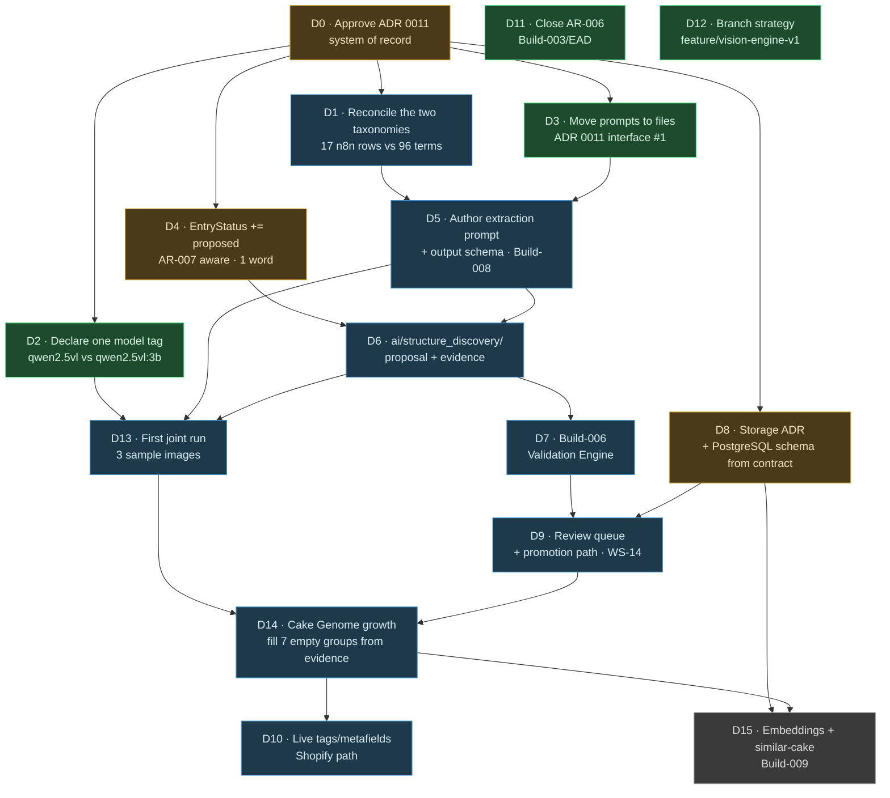

# Implementation Dependency Map — Dynamic Cake Intelligence

Date: 2026-08-20
Status: **Plan only.** Nothing below has been started. Sequencing document for the work specified in
[ADR 0011](../adr/2026-08-20-n8n-python-system-of-record.md),
[Dynamic Structure Discovery](../80_Dynamic_Structure_Discovery/SPECIFICATION.md) and the
[Vision Extraction Contract](../AI/VisionExtractionContract.md), against the gaps in
[ECP-200](ECP-200_Architecture_Gap_Analysis.md).

---

## 1. Dependency graph



`D11` and `D12` have no dependencies and no dependants — do them whenever.

---

## 2. The critical path

```
D0 → D1 → D5 → D6 → D7 → D9 → D14
```

Seven items. Everything else is either parallel or downstream. **D1 is the true bottleneck** —
not because it is hard, but because it is the only item requiring a judgement call about existing
hand-authored data that nothing else can make for you.

---

## 3. Work items

Estimates are relative effort, not calendar time.

### D0 — Approve ADR 0011 (system of record)

**Blocks:** everything. **Effort:** review only.
Nothing else can start, because every item below assumes a ruling on who owns what. If the ruling
goes differently from the ADR's recommendation, items D1, D3, D5 and D8 change shape entirely.

### D1 — Reconcile the two taxonomies ⚠️ **destructive if done carelessly**

**Depends on:** D0. **Blocks:** D5, and any export. **Effort:** medium; mostly judgement.

`ai/taxonomy/content/bakery_v1.json` — the
[Enterprise Master Taxonomy](../70_Enterprise_Master_Taxonomy/README.md), consumed by the
[Attribute Registry](../40_Enterprise_Attribute_Registry/README.md)'s `taxonomy_references` and by
the [Knowledge Graph](../KNOWLEDGE_GRAPH.md)'s `TaxonomyGraphResolver` — holds 26 attributes / 96
terms across 17 vocabularies.
`n8n/TBK-A-OS/Data Tables/tbk_taxonomy_attributes.csv` holds 17 rows across 3 `attribute_type`
values (`color`, `decoration`, `frosting_type`), with `tbk_taxonomy_synonyms` carrying real
typed synonyms (`butter cream` = alias, `buttercreme` = spelling, `bc` = abbreviation, each with its
own confidence) that **`bakery_v1.json` does not contain.**

Required, in order:

1. Map each of the 17 n8n rows to a `bakery_v1.json` term, or mark it as new.
2. Port the synonym data **into** `bakery_v1.json`'s `Term.synonyms` — it is real content and
   currently exists nowhere else. `Term.synonyms` is a bare `list[str]`, so the `match_type` and
   per-synonym confidence must either be dropped deliberately or captured another way. **Decide
   this explicitly; do not let it be lost by default.**
3. Only then generate the n8n tables from `bakery_v1.json`.

**Do not run step 3 before steps 1–2.** A one-way export destroys the synonym data.

### D2 — Declare one model tag

**Depends on:** D0. **Blocks:** D13. **Effort:** trivial.
Python config says `qwen2.5vl:3b`; the n8n workflow says `qwen2.5vl`. `model` is a provenance
field; two runs claiming different models for identical processing corrupts lineage. Pick one,
record it in both places.

### D3 — Move prompts out of workflow JSON into versioned files

**Depends on:** D0. **Blocks:** D5. **Effort:** small.
ADR 0011 interface #1. Until this happens `prompt_version` cannot be populated, so no record can
carry complete provenance.

### D4 — `EntryStatus += "proposed"` 🚪 **gate required**

**Depends on:** D0. **Blocks:** D6. **Effort:** one word, plus gate paperwork.
Additive, therefore a *minor* change under [Versioning.md](../10_Taxonomy/Versioning.md) — but it
touches **frozen Build-005 code**, so AR-007 must be aware of it. Every consumer must then treat
`"proposed"` as non-canonical: excluded from catalog resolution, EAL vocabulary validation, Shopify
distribution, and search indexing.

### D5 — Author the extraction prompt and output schema (Build-008)

**Depends on:** D1, D3. **Blocks:** D6, D13. **Effort:** large — the single highest-value item.
Fills the three 0-byte files. Per the
[Vision Extraction Contract](../AI/VisionExtractionContract.md): prompt is a template rendered
against the live taxonomy, output has two channels (`observations[]` + `unmatched[]`) plus
`unparsed[]`, and the constraint block is stated verbatim. The `unmatched` few-shot example is
load-bearing — without it, models reliably force values into the nearest listed field.

Depends on D1 because the rendered taxonomy digest must come from one taxonomy, not two.

### D6 — `ai/structure_discovery/`

**Depends on:** D4, D5. **Blocks:** D7, D13. **Effort:** medium.
Eight modules per [Discovery §5.2](../80_Dynamic_Structure_Discovery/SPECIFICATION.md). References
frozen packages, mutates none. `matcher.py` wraps the existing
`ai.attribute_intelligence.normalizer` rather than introducing a second matching rule.

### D7 — Build-006 Validation Engine

**Depends on:** D6. **Blocks:** D9. **Effort:** medium.
The only unbuilt Build with no open dependencies of its own — the four dimensions are already fully
specified in [Validation.md](../10_Taxonomy/Validation.md), and EAR/EAD already carry the
`validation_profile` / `allowed_values` / `confidence_expectations` fields it enforces. It is
sequenced after D6 only because proposals are what most need validating.

Its exit criterion (EPR Build-006): every deferred item in EAR's and EAD's own `Validation.md`
files is closed or explicitly re-deferred with a new reason. That includes the two AR-004 Minor
findings — "AI-derived ⇒ confidence set" and "enum ⇒ vocabulary present" — neither enforced today.

### D8 — Storage ADR + PostgreSQL schema 🚪 **gate required**

**Depends on:** D0. **Blocks:** D9, D15. **Effort:** medium.
The decision [VIG-003](../00_Governance/VIG-003-Data-Principles.md), EPR Build-007 and
[ADR 0009](../adr/2026-08-02-product-knowledge-graph.md) have each deferred in turn. ADR 0011
narrows it: PostgreSQL, schema generated from the Python contract. What remains is the physical
schema, the lineage model, and the AR-003 category-tree traversal question that EPR Risk R-7 says
must not be deferred a second time.

`TBK_n8n_Deployment_Operations.md` already contains a PostgreSQL DDL draft — start from it,
reconciled against the contract rather than replacing it.

### D9 — Review queue and promotion path (WS-14)

**Depends on:** D7, D8. **Blocks:** D14. **Effort:** medium.
The `HumanVerification` state machine and `ProposalStatus` lifecycle both exist as models. What is
missing is transport (a queue) and interface (somewhere to click approve). Minimum viable: a
reviewer can list `candidate`/`validated` proposals, approve or reject one, and have `promote()`
write an EAR `draft` entry and/or a `proposed` taxonomy entry.

**No automated promotion path exists at any confidence level.** EPR §04, VIG-007, and the standing
requirement all say so independently.

### D10 — Live Shopify `tags` / `metafields` path

**Depends on:** D14. **Effort:** medium.
`seo-ops/` queries and writes only `title`, `descriptionHtml`, `seo{}`, `productType`,
`priceRangeV2`, `options{}` — never `tags`, `metafields`, `variants` or `vendor`. This same missing
path blocks the Enterprise Collection Architecture's Phase 0. **Scope it once for both consumers,
not twice** — ECP-100 §22 flags two independently-built tag writers as a real risk.

Sequenced after D14 because writing an unvalidated genome to a live storefront inverts the whole
verification model.

### D11 — Close AR-006

**Depends on:** nothing. **Effort:** small. Open since 2026-07-27, flagged in ECP-100 §15.

### D12 — Branch strategy

**Depends on:** nothing. **Effort:** small, but a decision.
147 `ai/` files exist only on `feature/vision-engine-v1` — zero on `master`, `develop`,
`phase-a/production-safety`, `sync/live-theme-baseline`. The branch is 166 commits ahead of the
default branch and 0 behind. Either merge it or formally designate it the platform branch. Out of
scope by instruction for this phase; listed so it is not forgotten.

### D13 — First joint run

**Depends on:** D2, D5, D6. **Effort:** small.
Three sample images (`ai/vision/images/1-3.png`), one Ollama call each, through the real prompt and
the real matcher. Success is **not** "many attributes extracted" — it is:

- every observation carries complete provenance including `prompt_version`;
- at least one genuine `unmatched` item is produced, with a usable `why_unmatched`;
- nothing was forced into an approximate field;
- `value_state` correctly distinguishes `null` from `unknown` at least once.

The three sample images are `.gitignore`-allowlisted specifically for this kind of smoke test.

### D14 — Grow the Cake Genome from evidence

**Depends on:** D9, D13. **Effort:** ongoing content operation, not engineering.
Seven of thirty attribute groups hold no attribute at all — Classification, Material, Business,
Topper, Size, Flavour, Allergens. Three requested concepts (premium/luxury indicators, visual
complexity, customization indicators) have no group.

**Fill them from real proposals backed by real photographs, not by hand.** This is the discovery
mechanism's first and best test; pre-authoring them by guesswork wastes it and substitutes
invention for evidence.

### D15 — Embeddings + similar-cake search (Build-009)

**Depends on:** D8, D14. **Effort:** large. Genuinely later.
No package exists for either — `ai/embeddings/` and `ai/vectordb/` are **not present on disk**
(ECP-100 §15 described them as empty directories; git does not track empty directories).
`pgvector` has **zero hits repo-wide**.
Embeddings are already modeled as ordinary `data_type: "vector"` attributes rather than a parallel
entity system ([Relationship_Model.md](../10_Taxonomy/Relationship_Model.md)), so the data model
needs no change — only generation and an index.

---

## 4. Recommended order

| Wave | Items | Why together |
|---|---|---|
| **0 · Decide** | D0 | Nothing starts without it |
| **1 · Cheap and parallel** | D2, D3, D11, D12 | No dependencies between them; all small; D2/D3 unblock the critical path |
| **2 · Unblock** | D1, D4 | The two prerequisites. D1 needs care; D4 needs a gate |
| **3 · Build the core** | D5 → D6 | The functional requirement lives here |
| **4 · Prove it** | D13 | Three images. Do this before anything downstream |
| **5 · Make it trustworthy** | D7, D8, D9 | Validation, persistence, human approval — in that order |
| **6 · Grow** | D14 | Ongoing from here on |
| **7 · Extend** | D10, D15 | Only once the genome is trustworthy |

**D13 sits deliberately early.** Running three images through the real pipeline before building
validation, persistence and review will surface prompt and matcher problems while they are still
cheap — and it is the earliest point at which the whole idea can be shown to work or not.

---

## 5. Mapping n8n's `BUILD-3xx` to the documented sequence

The n8n project uses private numbering with no corresponding documents. ADR 0011 retires it. Best
reconstruction from workflow and Data Table content, recorded so the references are traceable
rather than orphaned:

| n8n label | Appears in | Closest documented equivalent |
|---|---|---|
| BUILD-304 | Taxonomy nodes | Build-005 Master Taxonomy |
| BUILD-305 | Attribute intelligence nodes | Build-303 / `ai.attribute_intelligence` |
| BUILD-306 | Validation nodes | Build-006 Validation Engine |
| BUILD-307 | `tbk_pi_config`: "BUILD-307 owns publish" | **No equivalent** — Shopify Publisher, unbuilt on both sides |
| BUILD-308…312 | Sync / embedding / search nodes | Build-009, Build-010 |

`tbk_pi_config` sets `default_status: draft` with the note *"Never auto-publish; BUILD-307 owns
publish"* — which agrees exactly with `CLAUDE.md`'s "Drafts stay drafts" golden rule. Good
discipline on the n8n side; preserve it through any migration.

---

## 6. Cross-program conflicts to avoid

1. **Two tag writers.** D10 and the Collection Architecture both need `tags`. One write path, one
   controlled vocabulary.
2. **Two taxonomies.** Resolved by D1 — but only if D1 is done before any export, not after.
3. **Two build numbering schemes.** Resolved by ADR 0011 + §5 above.
4. **Two provenance schemes.** Avoided by reusing `ai.eal.models.Provenance` verbatim; the n8n
   tables gain provenance columns rather than inventing their own shape.
5. **Product Genome vs. Cake Genome drift.** Two layers, not two names.
   [GLOSSARY.md](../00_Foundation/GLOSSARY.md) is the single answer.

---

## Related

[ADR 0011](../adr/2026-08-20-n8n-python-system-of-record.md),
[ECP-200](ECP-200_Architecture_Gap_Analysis.md), [ECP-100](ECP-100_Architecture_Review.md),
[Dynamic Structure Discovery](../80_Dynamic_Structure_Discovery/SPECIFICATION.md),
[Vision Extraction Contract](../AI/VisionExtractionContract.md),
[GLOSSARY.md](../00_Foundation/GLOSSARY.md),
[Enterprise_Program_Roadmap_v1.md](Enterprise_Program_Roadmap_v1.md).
