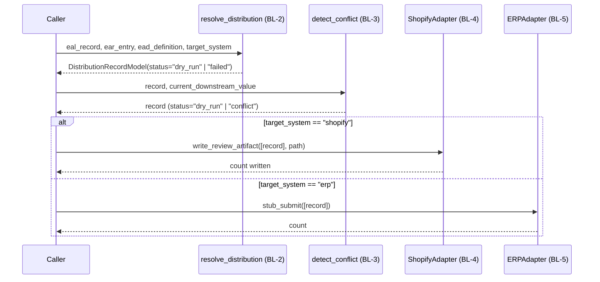
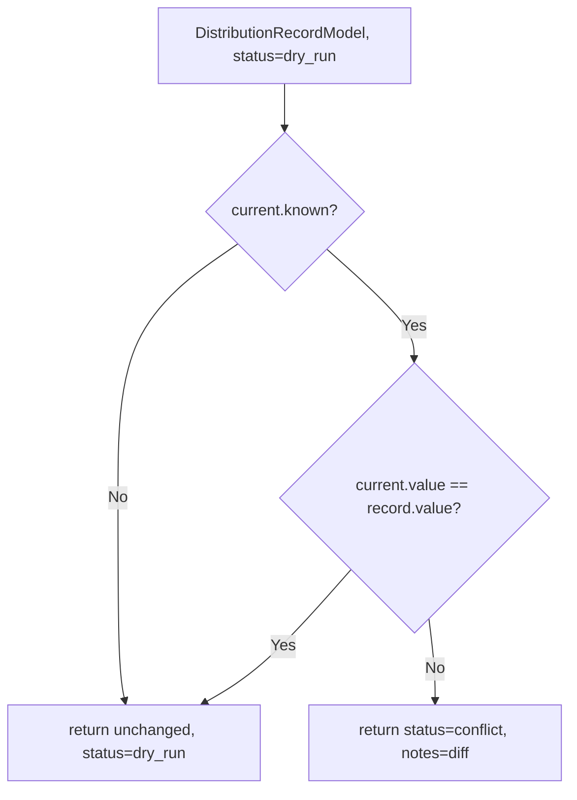
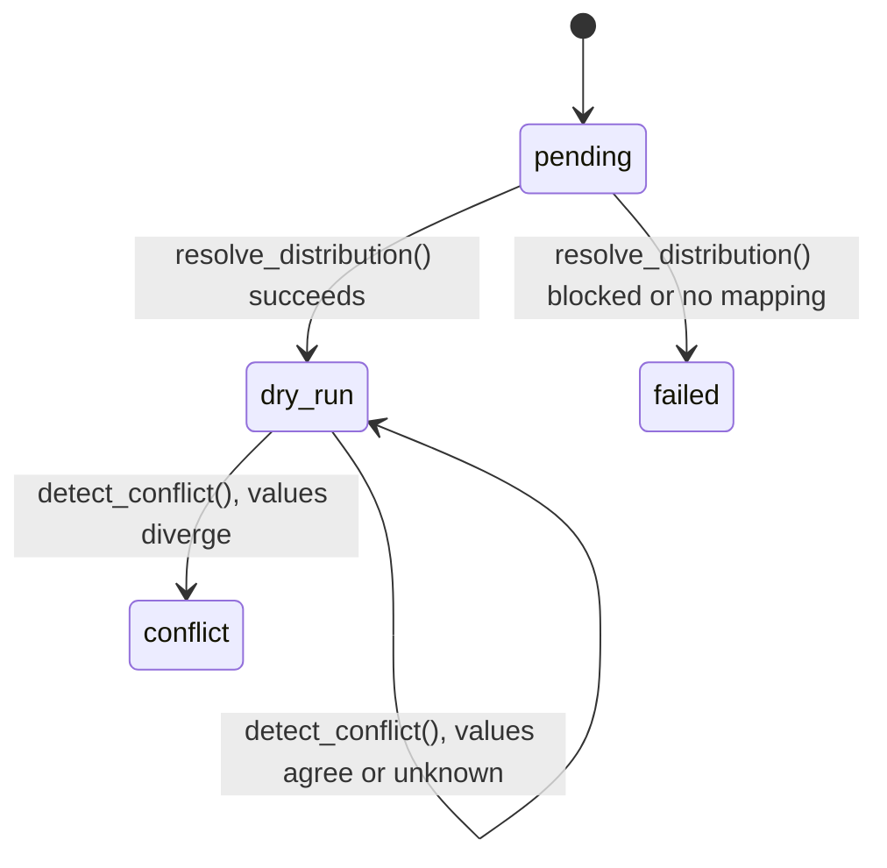

# Enterprise Attribute Distribution v1 — Specification

## What Build-004 is

The write path from a validated `EALAttributeRecord` (Build-001), resolved by its EAR registry
entry (Build-002) and enriched by its EAD Definition's mapping guidance (Build-003), to a target
system — Shopify or ERP. Workstream **ATTR**, per
[ADR 0006](../adr/2026-07-27-workstream-id-convention.md). This sprint stays dry-run/stubbed only —
no live write to the production Shopify store or a real ERP endpoint (see
[Enterprise Program Roadmap §07](../30_Enterprise_Program_Roadmap/Enterprise_Program_Roadmap_v1.md#section-07--build-roadmap)).

## `DistributionRecord` — field reference

```
distribution_id             deterministic uuid5(registry_reference, target_system) - ai/attribute_distribution/ids.py
registry_reference           EAR attribute_id - format-validated via ai.ear.ids.is_valid_attribute_id
target_system                "shopify" | "erp"
value                        the value being distributed
external_id                  ExternalIdModel | None (reused from ai.eal) - required iff status in
                            ("dry_run", "success"); None when resolution failed (no mapping, or
                            blocked by verification gating)
human_verification_status      reuses ai.eal's VerificationStatus values
confidence                   float | None, range [0,1]
status                       "pending" | "dry_run" | "success" | "failed" | "conflict"
notes                        required iff status in ("failed", "conflict"), forbidden otherwise
                            (renamed from conflict_notes in BL-2, generalized to cover both)
distribution_version          "1.0"
```

## Pipeline diagrams

### Sequence



### Flow (conflict decision)



### State (`DistributionRecord.status`, cumulative across BL-2/BL-3)



Only `dry_run` records are eligible for either Adapter (BL-4/BL-5) — `failed` and `conflict`
records are excluded, proven directly by
[`test_round_trip_real_conflict_excluded_from_distribution`](../../ai/attribute_distribution/test_attribute_distribution.py).

## Module reference

### `resolve_distribution()` (BL-2) — pure mapping resolution

`ai/attribute_distribution/resolver.py::resolve_distribution(eal_record, ear_entry, ead_definition,
target_system) -> DistributionRecordModel`. Pure function — no HTTP, no Shopify/ERP calls, no
database, no file writes, no AI calls, no retries.

1. Validates the three inputs actually describe the same attribute (`ear_entry.eal_reference ==
   eal_record.canonical_path`, `ead_definition.registry_reference == ear_entry.attribute_id`) —
   raises `ValueError` on mismatch (a caller bug, not a business outcome).
2. Looks up `ead_definition.shopify_mapping`/`erp_mapping` for the target system. `None` → resolves
   to `status="failed"` (no mapping defined yet, e.g. a draft attribute).
3. **Verification gate (Risk R-9)** — the one real policy decision this Build makes: Shopify is
   treated as customer-facing (requires `human_verification.status` in `verified`/`corrected`);
   ERP is treated as internal/low-stakes (any status allowed). Fails cleanly to `status="failed"`
   with an explanatory `notes`, not an exception, when blocked.
4. Otherwise resolves to `status="dry_run"` with the concrete `external_id` and `value` to write.

### `detect_conflict()` (BL-3) — pure conflict detection

`ai/attribute_distribution/conflicts.py::detect_conflict(record, current) ->
DistributionRecordModel`. Composed *after* `resolve_distribution()`, not merged into it. No I/O.

`CurrentDownstreamValue { known: bool; value: Any = None }` mirrors EAL's own `value_state`
three-state distinction (present/null/unknown,
[Null_and_Unknown_Standard.md](../20_Attribute_Language/Null_and_Unknown_Standard.md)) — `known=False`
means no real read has been attempted yet, not that the downstream value is empty.

1. Requires `record.status == "dry_run"` — raises `ValueError` otherwise.
2. `current.known == False` → unchanged.
3. `current.known == True` and values agree → unchanged.
4. `current.known == True` and values differ → `status="conflict"`, `notes` stating both values.

### `ShopifyAdapter` (BL-4) — Adapter layer, dry-run

`ai/attribute_distribution/shopify_adapter.py::ShopifyAdapter` — the one place every Shopify-facing
responsibility for this Build lives, deliberately class-based so future responsibilities (preview,
export, import, validation, sync, real Admin API integration — all later Builds) are added as new
methods on this same class, never a rename. Distinct on purpose from `ai.{eal,ear,ead}.exporter`
(JSON/YAML serialization of a module's own records) — this class shapes a preview of what would be
sent to an external system, it does not serialize this module's own state.

**One method**: `write_review_artifact(records, path) -> int`. Dry-run only — no network call of
any kind, not even a GET, matching this repo's own `seo-ops/` dry-run-by-default convention
(`docs/CODING_STANDARDS.md`). Writes one JSON object per line for every record where
`target_system == "shopify"` and `status == "dry_run"`; other records are silently skipped.

### `ERPAdapter` (BL-5) — Adapter layer, fully stubbed

`ai/attribute_distribution/erp_adapter.py::ERPAdapter` — the ERP counterpart to `ShopifyAdapter`,
same class shape, deliberately **thinner**: TBK Kitchen ERP's real write API is unknown
([Enterprise Program Roadmap §13](../30_Enterprise_Program_Roadmap/Enterprise_Program_Roadmap_v1.md#section-13--erp-integration-strategy),
Risk R-3), so this class cannot shape a realistic payload — it proves the interface seam exists,
nothing more.

**One method**: `stub_submit(records) -> int`. Fully stubbed — no network, no database, no file
write, no external side effect. Counts ERP-target `dry_run` records; takes no `path`/`url`
parameter at all, which is itself the proof it cannot perform I/O.

### Package re-exports

`ai/attribute_distribution/__init__.py` re-exports the full public surface —
`DistributionRecord(Model)`, `compute_distribution_id`, `resolve_distribution`,
`CurrentDownstreamValue`/`detect_conflict`, `ShopifyAdapter`, `ERPAdapter`.

## Identifier strategy

`distribution_id` is content-hash-derived (`uuid.uuid5`), same no-coordination-needed philosophy as
[EAR](../40_Enterprise_Attribute_Registry/EAR_SPECIFICATION.md)/[EAD](../50_Enterprise_Attribute_Definitions/EAD_SPECIFICATION.md)'s
own identifiers — derived from `(registry_reference, target_system)` rather than
`registry_reference` alone, since one EAR attribute can be distributed to more than one target
system, each a distinct attempt with its own identity. Distinct namespace UUID from EAR's and EAD's
(`ai/attribute_distribution/ids.py::DISTRIBUTION_NAMESPACE_UUID`) so a `distribution_id` can never
collide with a `registry_uuid` or `definition_id`.

## Folder structure

```
ai/attribute_distribution/
  __init__.py            re-exports
  models.py               DistributionRecord dataclass
  models_pydantic.py        DistributionRecordModel (validation)
  ids.py                   distribution_id derivation
  resolver.py               BL-2, pure mapping resolution
  conflicts.py              BL-3, pure conflict detection
  shopify_adapter.py         BL-4, ShopifyAdapter
  erp_adapter.py             BL-5, ERPAdapter
  test_attribute_distribution.py  self-check for all of the above

docs/60_Enterprise_Attribute_Distribution/  this specification and its siblings
```

No `schemas/`/`examples/` directory of its own — see [Examples.md](Examples.md) for why.

## What Build-004 deliberately does not do

- Does not write to the live production Shopify store or a real ERP endpoint (Scope, this sprint).
- Does not guess at TBK Kitchen ERP's real field names, authentication, or write semantics
  (Enterprise Program Roadmap §13).
- Does not modify `ai/eal/`, `ai/ear/`, or `ai/ead/` — all three are read-only contracts.

## Related Standards

Reuses [EAL](../20_Attribute_Language/README.md) (`ExternalIdModel`, `VerificationStatus`,
confidence range, `value_state`) and [EAR](../40_Enterprise_Attribute_Registry/README.md)
(`registry_reference` format) directly. Scoped by
[Enterprise Program Roadmap §07](../30_Enterprise_Program_Roadmap/Enterprise_Program_Roadmap_v1.md#section-07--build-roadmap)
and [ADR 0006](../adr/2026-07-27-workstream-id-convention.md). See [README.md](README.md) for the
document index.
