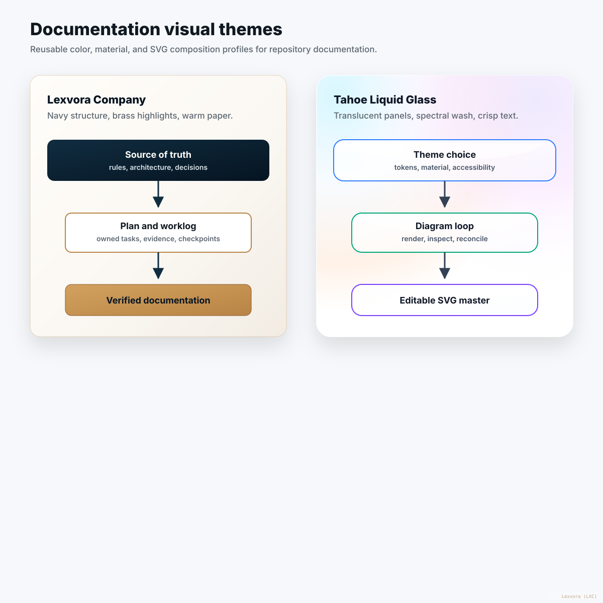
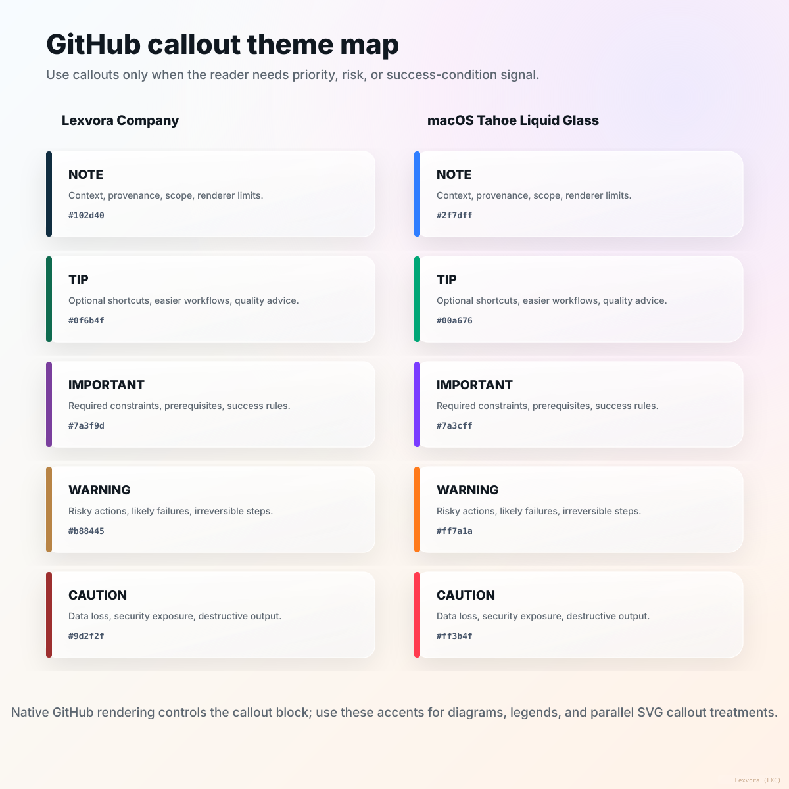
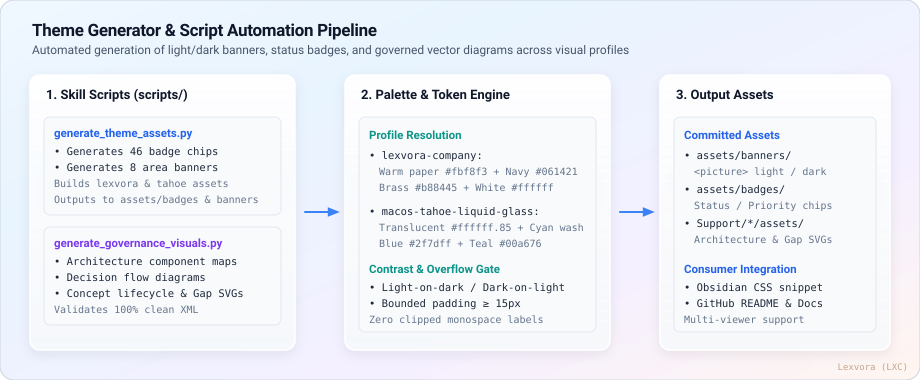

<picture>
  <source media="(prefers-color-scheme: dark)" srcset="./assets/banners/lexvora/documentation-dark.svg">
  
</picture>

# ThemeStyleOps

> **Reusable documentation visual themes, tokens, and vector-asset rules**  
> **Version:** `2.2.1` · **Status:**  · **Themes:** `lexvora-company` · `macos-tahoe-liquid-glass`  
> **Parent Plan:** [`Support/plans/01-skills/ThemeStyleOps/theme-style-ops-plan.md`](../../Support/plans/01-skills/ThemeStyleOps/theme-style-ops-plan.md) · **Skills Index:** [`Support/plans/01-skills/skills-master.md`](../../Support/plans/01-skills/skills-master.md)

---

## Overview

**`ThemeStyleOps`** is the repository-native visual design system and asset generation engine. It enforces repeatable design tokens, dual-theme styling profiles, high-contrast SVG vector standards, GitHub callout contracts, and cross-platform Markdown viewer compatibility across all documentation and diagram assets.



---

## Supported Theme Profiles

`ThemeStyleOps` provides two production-grade design systems:

| S.No. | Theme Profile | Key Tokens & Palette | Best Fit & Aesthetic |
| ---: | --- | --- | --- |
| 1 | **`lexvora-company`** | Warm Paper (`#fbf8f3`), Deep Navy (`#061421`), Radiant Gold (`#d2a15f`), Slate (`#475569`) | Formal corporate architecture, repository governance, whitepapers, decision records, and audit ledgers. |
| 2 | **`macos-tahoe-liquid-glass`** | Frosted Glass (`#0b132b` Dark / `#f0f4f8` Light), Translucent Layers, System Blue (`#007aff`), Vivid Accents | Modern developer tools, interactive workflows, pipeline visuals, SDK guides, and consumer READMEs. |

---

## Selecting a theme

### Copy-paste prompts

Copy any line into your agent — it works exactly as pasted. The Lexvora and Tahoe lines are
identical except the theme word; swap `<target>` for a file, a folder, or a single asset.

```text
Apply the Lexvora theme to <target>.
Apply the Tahoe theme to <target>.
Audit the Lexvora theme in <target>.      # report the fixes, change nothing
Audit the Tahoe theme in <target>.        # report the fixes, change nothing
```

Two operations only — **apply** (write the profile's tokens in) and **audit** (report, no edits).
The **same sentence works for every surface** — README, Plan, diagram, SVG, GitHub callout,
Mermaid, MathJax/LaTeX. There is no per-surface command and no "mode"; the theme applies to
whichever surfaces the target contains.

### Aliases

Each row's names are equivalent; the trailing word `theme` is optional. Full list in `SKILL.md` →
*Shortcut aliases*.

| Aliases (all equivalent) | Resolved Theme Profile | Reference Guide |
| :--- | :--- | :--- |
| `LXC theme`, `Lexvora theme`, `Lexvora company theme` | `lexvora-company` | [`references/lexvora-company.md`](./references/lexvora-company.md) |
| `macOS theme`, `Tahoe theme`, `Liquid Glass theme` | `macos-tahoe-liquid-glass` | [`references/macos-tahoe-liquid-glass.md`](./references/macos-tahoe-liquid-glass.md) |

### If you don't name a theme

Resolution order (`SKILL.md` → *Resolving the active theme*;
[`DEC_20260902_A`](../../Support/decisions/DEC_20260902_A_theme_aware_visual_generation_flow.md)):

1. explicit alias in the request → that theme, this run only
2. repository name contains `LXC` or `Lexvora` → `lexvora-company`
3. otherwise → `macos-tahoe-liquid-glass` (the global default)

A recorded project default (for a `projectops` repo, `rules.md` §13 — this repository:
`lexvora-company`) takes the place of steps 2–3.

`svgImageOpsLoop` and other documentation workflows call this skill themselves — you do not theme
them separately. Called directly they are **stateless**: pass the theme each run, or take the
resolved default. To set one theme for a whole repository and have every workflow use it, use
`projectops`, which records and manages the per-repo default.

---

## GitHub Callout System

GitHub callouts provide native severity cues without custom CSS. The callout label defines the semantic contract:



| Callout Type | Semantic Role | Lexvora Accent | Tahoe Accent | Markdown Usage |
| :--- | :--- | :---: | :---: | :--- |
| `> [!NOTE]` | Stable context, background facts, provenance | `#102d40` | `#2f7dff` | Context & background |
| `> [!TIP]` | Optional shortcuts, authoring recommendations | `#0f6b4f` | `#00a676` | Quality suggestions |
| `> [!IMPORTANT]` | Prerequisites, mandatory rules, core constraints | `#7a3f9d` | `#7a3cff` | Required constraints |
| `> [!WARNING]` | Risky actions, likely failure modes, hazards | `#b88445` | `#ff7a1a` | Breaking changes |
| `> [!CAUTION]` | Destructive consequences, security exposures | `#9d2f2f` | `#ff3b4f` | Data loss & security |

Read [`references/github-callouts.md`](./references/github-callouts.md) for full usage rules.

---

## Scripts & Automation Engine

Deterministic Python utilities automate batch asset generation and visual validation across both theme profiles. See [`scripts/README.md`](./scripts/README.md) for complete CLI options.



### CLI Execution:

```bash
# 1. Generate badges & banners across all profiles
python3 skills/ThemeStyleOps/scripts/generate_theme_assets.py

# 2. Generate and validate governance vector diagrams (Dual-Theme CLI)
python3 skills/ThemeStyleOps/scripts/generate_governance_visuals.py --theme all

# 3. Validate specific theme only (e.g. lexvora or tahoe)
python3 skills/ThemeStyleOps/scripts/generate_governance_visuals.py --theme lexvora
```

---

## Technical References & Design Specifications

- 🏛️ [**Lexvora Company Palette Specification**](./references/lexvora-company.md) — Warm paper tokens, typography, and contrast rules.
- 🪟 [**macOS Tahoe Liquid Glass Specification**](./references/macos-tahoe-liquid-glass.md) — Glass translucency, gradient stops, and lighting model.
- 🎨 [**Diagram Color System**](./references/diagram-color-system.md) — Semantic roles for nodes, edges, containers, and badges.
- 📐 [**SVG Composition Rules**](./references/svg-composition-rules.md) — Layout hierarchy, text safety bounds, and accessibility.
- 📱 [**Offline Markdown Viewer Compatibility**](./references/offline-viewer-compatibility.md) — `<picture>` fallbacks for Obsidian, Typora, and VS Code.
- 🏷️ [**Banner & Badge Catalog System**](./references/banner-and-badge-system.md) — Complete inventory of the 46 status chips and 14 area banners.
- 🌐 [**GitHub Rendering Contract**](./references/github-rendering.md) — Surviving GitHub Markdown sanitization and dark mode switching.
- 🔢 [**LaTeX & MathJax Guide**](./references/latex-mathjax.md) — KaTeX math formulas and typographical alignment.

---

## Samples & Galleries

- 🖼️ [**Theme Asset Gallery**](./samples/theme-asset-gallery.md) — Live rendering of every generated banner and status chip.
- 🧪 [**Visual Theme Sample**](./samples/visual-theme-sample.md) — Interactive showcase of diff blocks, Mermaid charts, callouts, and SVGs.
- 📂 [**Lexvora Sample Documentation**](./samples/lexvora/README.md) — 14 sample documents styled in Lexvora Company theme.
- 📂 [**Tahoe Sample Documentation**](./samples/tahoe/README.md) — The same 14 documents styled in macOS Tahoe Liquid Glass theme.
- 🎨 [**Obsidian CSS Snippet**](./samples/lexvora-visual-theme.css) — Custom theme snippet for local Obsidian vaults (`assets/styles/obsidian-lexvora.css`).

---

## Ecosystem Integration

- 🔄 [`svgImageOpsLoop`](../svgImageOpsLoop/README.md) — The continuous 8-step visual engineering loop that consumes these theme tokens.
- ⚙️ [`projectops`](../projectops/README.md) — The repository operating engine enforcing build gates, governance, and Git sync.
- 📜 [`Support/rules.md`](../../Support/rules.md) — Repository styling rules (§13 Visual Theme, §14 Git sync).
- 📋 [`Support/documentation/diagram-plan.md`](../../Support/documentation/diagram-plan.md) — Master inventory of all repository vector assets.
- 📦 [`Support/plans/01-skills/ThemeStyleOps/theme-style-ops-plan.md`](../../Support/plans/01-skills/ThemeStyleOps/theme-style-ops-plan.md) — Delivery and release plan for this skill.
