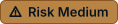

# Theme Asset Gallery

Every generated badge and banner, rendered as GitHub serves it. This page is written by
[`../scripts/generate_theme_assets.py`](../scripts/generate_theme_assets.py); edit the
script and re-run it rather than editing this file.

## Navigation

Parent: [`README.md`](../README.md) · Contract: [`SKILL.md`](../SKILL.md) · Rules:
[`banner-and-badge-system.md`](../references/banner-and-badge-system.md) ·
[`github-rendering.md`](../references/github-rendering.md)

## Table of Contents

- [Navigation](#navigation)
- [Banners](#banners)
- [Badges](#badges)
- [Sample Documentation Sets](#sample-documentation-sets)
- [Regenerating](#regenerating)

## Sample Documentation Sets

These assets applied to a complete governed documentation set, one per theme profile.
Both sets carry identical content so they can be compared directly.

| S.No. | Set | Theme |
| ---: | --- | --- |
| 1 | [`lexvora/`](./lexvora/) | Lexvora Company |
| 2 | [`tahoe/`](./tahoe/) | macOS Tahoe Liquid Glass |

## Banners

One banner per governed documentation area, in both theme profiles. Each is a
light/dark pair; the embed below switches automatically with the reader's GitHub
appearance.

### Lexvora Company

**Support** — Documentation system entry point and navigation

<picture>
  <source media="(prefers-color-scheme: dark)" srcset="../assets/banners/lexvora/support-dark.svg">
  
</picture>

**Rules** — Binding constraints that govern how work is done

<picture>
  <source media="(prefers-color-scheme: dark)" srcset="../assets/banners/lexvora/rules-dark.svg">
  
</picture>

**Context** — Current state, scope, and working assumptions

<picture>
  <source media="(prefers-color-scheme: dark)" srcset="../assets/banners/lexvora/context-dark.svg">
  
</picture>

**Documentation** — Ownership, structure, and documentation planning

<picture>
  <source media="(prefers-color-scheme: dark)" srcset="../assets/banners/lexvora/documentation-dark.svg">
  
</picture>

**Research** — Investigations, findings, and evidence

<picture>
  <source media="(prefers-color-scheme: dark)" srcset="../assets/banners/lexvora/research-dark.svg">
  
</picture>

**Concept & Design** — Statements, questions, and proposed direction

<picture>
  <source media="(prefers-color-scheme: dark)" srcset="../assets/banners/lexvora/concept-design-dark.svg">
  
</picture>

**Architecture** — Systems, frameworks, and repository dependencies

<picture>
  <source media="(prefers-color-scheme: dark)" srcset="../assets/banners/lexvora/architecture-dark.svg">
  
</picture>

**Decisions** — Accepted direction with rationale and consequence

<picture>
  <source media="(prefers-color-scheme: dark)" srcset="../assets/banners/lexvora/decisions-dark.svg">
  
</picture>

**Plans** — Committed work, tasks, milestones, and statistics

<picture>
  <source media="(prefers-color-scheme: dark)" srcset="../assets/banners/lexvora/plans-dark.svg">
  
</picture>

**Changelog** — What changed, when, and why

<picture>
  <source media="(prefers-color-scheme: dark)" srcset="../assets/banners/lexvora/changelog-dark.svg">
  
</picture>

**Gaps & Issues** — Intake register for defects, drift, and open risk

<picture>
  <source media="(prefers-color-scheme: dark)" srcset="../assets/banners/lexvora/gaps-issues-dark.svg">
  
</picture>

**Worklog** — Execution record and multi-agent handoff

<picture>
  <source media="(prefers-color-scheme: dark)" srcset="../assets/banners/lexvora/worklog-dark.svg">
  
</picture>

**Verification** — Evidence that proves the work actually holds

<picture>
  <source media="(prefers-color-scheme: dark)" srcset="../assets/banners/lexvora/verification-dark.svg">
  
</picture>

**Release** — Cut, tagged, and shipped state of the work

<picture>
  <source media="(prefers-color-scheme: dark)" srcset="../assets/banners/lexvora/release-dark.svg">
  
</picture>

### macOS Tahoe Liquid Glass

**Support** — Documentation system entry point and navigation

<picture>
  <source media="(prefers-color-scheme: dark)" srcset="../assets/banners/tahoe/support-dark.svg">
  
</picture>

**Rules** — Binding constraints that govern how work is done

<picture>
  <source media="(prefers-color-scheme: dark)" srcset="../assets/banners/tahoe/rules-dark.svg">
  
</picture>

**Context** — Current state, scope, and working assumptions

<picture>
  <source media="(prefers-color-scheme: dark)" srcset="../assets/banners/tahoe/context-dark.svg">
  
</picture>

**Documentation** — Ownership, structure, and documentation planning

<picture>
  <source media="(prefers-color-scheme: dark)" srcset="../assets/banners/tahoe/documentation-dark.svg">
  
</picture>

**Research** — Investigations, findings, and evidence

<picture>
  <source media="(prefers-color-scheme: dark)" srcset="../assets/banners/tahoe/research-dark.svg">
  
</picture>

**Concept & Design** — Statements, questions, and proposed direction

<picture>
  <source media="(prefers-color-scheme: dark)" srcset="../assets/banners/tahoe/concept-design-dark.svg">
  
</picture>

**Architecture** — Systems, frameworks, and repository dependencies

<picture>
  <source media="(prefers-color-scheme: dark)" srcset="../assets/banners/tahoe/architecture-dark.svg">
  
</picture>

**Decisions** — Accepted direction with rationale and consequence

<picture>
  <source media="(prefers-color-scheme: dark)" srcset="../assets/banners/tahoe/decisions-dark.svg">
  
</picture>

**Plans** — Committed work, tasks, milestones, and statistics

<picture>
  <source media="(prefers-color-scheme: dark)" srcset="../assets/banners/tahoe/plans-dark.svg">
  
</picture>

**Changelog** — What changed, when, and why

<picture>
  <source media="(prefers-color-scheme: dark)" srcset="../assets/banners/tahoe/changelog-dark.svg">
  
</picture>

**Gaps & Issues** — Intake register for defects, drift, and open risk

<picture>
  <source media="(prefers-color-scheme: dark)" srcset="../assets/banners/tahoe/gaps-issues-dark.svg">
  
</picture>

**Worklog** — Execution record and multi-agent handoff

<picture>
  <source media="(prefers-color-scheme: dark)" srcset="../assets/banners/tahoe/worklog-dark.svg">
  
</picture>

**Verification** — Evidence that proves the work actually holds

<picture>
  <source media="(prefers-color-scheme: dark)" srcset="../assets/banners/tahoe/verification-dark.svg">
  
</picture>

**Release** — Cut, tagged, and shipped state of the work

<picture>
  <source media="(prefers-color-scheme: dark)" srcset="../assets/banners/tahoe/release-dark.svg">
  
</picture>

## Badges

Chips are self-contained: each carries its own fill, border, icon, and label, so a
single file reads correctly in both light and dark appearance. The label always states
the meaning, so nothing is lost when images are disabled.

### Plan status ladder

Applied to a Plan as a whole in `plans/`.

| S.No. | Lexvora Company | macOS Tahoe Liquid Glass | Slug | Semantic role |
| ---: | --- | --- | --- | --- |
| 1 |  |  | `plan-not-started` | `muted` |
| 2 |  |  | `plan-planning` | `system` |
| 3 |  |  | `plan-structure-ready` | `system` |
| 4 |  |  | `plan-review` | `decision` |
| 5 |  |  | `plan-accepted` | `success` |
| 6 |  |  | `plan-implemented` | `success` |
| 7 |  |  | `plan-verified` | `success` |

### Record status ladder

Applied to concepts, research, and traceability rows.

| S.No. | Lexvora Company | macOS Tahoe Liquid Glass | Slug | Semantic role |
| ---: | --- | --- | --- | --- |
| 1 |  |  | `draft` | `muted` |
| 2 |  |  | `open-question` | `decision` |
| 3 |  |  | `active` | `system` |
| 4 |  |  | `proposed` | `decision` |
| 5 |  |  | `confirmed` | `success` |
| 6 |  |  | `planned` | `system` |
| 7 |  |  | `in-delivery` | `system` |
| 8 |  |  | `resolved-by-addition` | `success` |
| 9 |  |  | `future-held` | `muted` |
| 10 |  |  | `on-hold` | `muted` |
| 11 |  |  | `rejected` | `risk` |
| 12 |  |  | `superseded` | `muted` |
| 13 |  |  | `deprecated` | `risk` |

### Architecture states

Applied to architecture records.

| S.No. | Lexvora Company | macOS Tahoe Liquid Glass | Slug | Semantic role |
| ---: | --- | --- | --- | --- |
| 1 |  |  | `arch-current` | `success` |
| 2 |  |  | `arch-target` | `system` |
| 3 |  |  | `arch-tbd` | `muted` |

### Gap register states

Applied to rows in `gaps-issues/`.

| S.No. | Lexvora Company | macOS Tahoe Liquid Glass | Slug | Semantic role |
| ---: | --- | --- | --- | --- |
| 1 |  |  | `gap-open` | `decision` |
| 2 |  |  | `gap-resolved` | `success` |
| 3 |  |  | `gap-blocked` | `risk` |

### Risk, priority, and estimate

Applied to any row that carries sizing or exposure.

| S.No. | Lexvora Company | macOS Tahoe Liquid Glass | Slug | Semantic role |
| ---: | --- | --- | --- | --- |
| 1 |  |  | `question` | `decision` |
| 2 |  |  | `risk-low` | `success` |
| 3 |  |  | `risk-medium` | `decision` |
| 4 |  |  | `risk-high` | `risk` |
| 5 |  |  | `priority-p1` | `risk` |
| 6 |  |  | `priority-p2` | `decision` |
| 7 |  |  | `priority-p3` | `muted` |
| 8 |  |  | `estimate-s` | `system` |
| 9 |  |  | `estimate-m` | `system` |
| 10 |  |  | `estimate-l` | `system` |
| 11 |  |  | `estimate-xl` | `system` |

### Record types

Applied in navigation tables and indexes.

| S.No. | Lexvora Company | macOS Tahoe Liquid Glass | Slug | Semantic role |
| ---: | --- | --- | --- | --- |
| 1 |  |  | `type-plan` | `governing` |
| 2 |  |  | `type-concept` | `governing` |
| 3 |  |  | `type-research` | `governing` |
| 4 |  |  | `type-decision` | `governing` |
| 5 |  |  | `type-rule` | `governing` |
| 6 |  |  | `type-architecture` | `governing` |
| 7 |  |  | `type-worklog` | `governing` |
| 8 |  |  | `type-gap` | `governing` |
| 9 |  |  | `type-verification` | `governing` |

## Regenerating

```bash
python3 skills/ThemeStyleOps/scripts/generate_theme_assets.py
```

Add a chip or an area by editing `BADGES` or `BANNERS` in the script, then re-run it.
Assets and this gallery are rewritten together.

## Footer Navigation

Parent: [`README.md`](../README.md) · Rules:
[`banner-and-badge-system.md`](../references/banner-and-badge-system.md)
